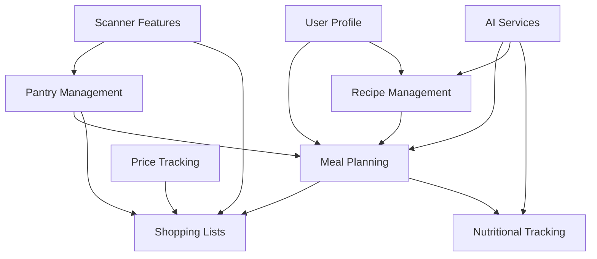

# Features Documentation - KeCarajoComer

**Version**: 1.0  
**Last Updated**: January 2025

## Table of Contents

1. [Authentication & User Management](#authentication--user-management)
2. [Recipe Management](#recipe-management)
3. [Meal Planning](#meal-planning)
4. [Pantry Management](#pantry-management)
5. [Shopping Lists](#shopping-lists)
6. [AI Integration](#ai-integration)
7. [Scanner Features](#scanner-features)
8. [Nutritional Tracking](#nutritional-tracking)
9. [Price Tracking](#price-tracking)
10. [User Interface Features](#user-interface-features)

---

## Authentication & User Management

### Overview
Secure authentication system using Supabase Auth with social login support and comprehensive user profile management.

### Features

#### User Registration
- **Email/Password**: Traditional registration with email verification
- **Social Auth**: Google, GitHub integration ready
- **Onboarding Flow**: Multi-step profile setup for new users
- **Profile Completion**: Dietary preferences, household size, cooking skills

#### User Profiles
- **Basic Information**: Name, avatar, bio
- **Dietary Preferences**: 
  - Restrictions (vegetarian, vegan, gluten-free, etc.)
  - Allergies tracking
  - Disliked ingredients
  - Cuisine preferences
- **Household Settings**: Number of people, meal planning defaults
- **Cooking Preferences**: Skill level, time constraints, equipment

#### Session Management
- **Persistent Sessions**: Remember me functionality
- **Multi-device Support**: Sync across devices
- **Security**: Secure token storage, automatic refresh

### Technical Implementation
```typescript
// Authentication flow
/src/features/auth/
├── components/
│   ├── LoginForm.tsx
│   ├── RegisterForm.tsx
│   └── onboarding/ProfileSetupStep.tsx
├── hooks/
│   └── useAuth.ts
└── services/
    └── authService.ts

// Profile Context
/src/contexts/ProfileContext.tsx
```

### API Endpoints
- `POST /api/auth/register` - User registration
- `POST /api/auth/login` - User login
- `GET /api/profile` - Get user profile
- `PATCH /api/profile` - Update profile
- `POST /api/profile/avatar` - Upload avatar

---

## Recipe Management

### Overview
Comprehensive recipe system with AI generation, search, filtering, and management capabilities.

### Features

#### Recipe Discovery
- **Browse Recipes**: Grid/list view with filtering
- **Search**: Full-text search with autocomplete
- **Filters**: 
  - Meal type (breakfast, lunch, dinner, snack)
  - Cuisine type
  - Dietary restrictions
  - Cooking time
  - Difficulty level
  - Ingredients

#### Recipe Details
- **Ingredients List**: With measurements and substitutions
- **Step-by-Step Instructions**: Clear, numbered steps
- **Nutritional Information**: Calories, macros, vitamins
- **Cooking Info**: Prep time, cook time, servings
- **User Ratings**: 5-star rating system with reviews
- **Photos**: Multiple images per recipe

#### Recipe Interactions
- **Save/Favorite**: Personal recipe collection
- **Rate & Review**: Community feedback
- **Share**: Social sharing capabilities (planned)
- **Print**: Printer-friendly version
- **Scale**: Adjust serving sizes with automatic ingredient scaling

#### AI Recipe Generation
- **From Pantry**: Generate recipes using available ingredients
- **Custom Creation**: Specify preferences and constraints
- **Variation Generation**: Create variations of existing recipes
- **Dietary Adaptation**: Modify recipes for dietary needs

### Technical Implementation
```typescript
// Recipe components
/src/components/recipes/
├── RecipeCard.tsx
├── RecipeDetail.tsx
├── EnhancedRecipeGrid.tsx
└── RecipeFilters.tsx

// Recipe features
/src/features/recipes/
├── components/
│   ├── RecipeCreationModal.tsx
│   └── RecipeGenerator.tsx
├── hooks/
│   └── useRecipes.ts
└── services/
    └── recipeService.ts
```

### API Endpoints
- `GET /api/recipes` - List recipes with filters
- `GET /api/recipes/[id]` - Get recipe details
- `POST /api/recipes` - Create new recipe
- `POST /api/recipes/generate` - AI generate recipe
- `POST /api/recipes/favorite` - Save to favorites
- `POST /api/recipes/rate` - Rate recipe

---

## Meal Planning

### Overview
Intelligent weekly meal planning with drag-and-drop interface and AI-powered suggestions.

### Current Status
⚠️ **Note**: Multiple meal planner implementations exist and need consolidation.

### Features

#### Weekly Planning
- **Calendar View**: 7-day week view with meals
- **Meal Slots**: Breakfast, lunch, dinner, snacks
- **Drag & Drop**: Rearrange meals easily
- **Quick Actions**: 
  - Add meal to slot
  - Remove meal
  - Generate suggestions
  - Copy to another day

#### AI Planning Assistant
- **Weekly Generation**: Complete week meal plan
- **Smart Suggestions**: Based on:
  - Dietary preferences
  - Nutritional goals
  - Pantry inventory
  - Previous meals
  - Season/weather
  - Budget constraints

#### Plan Management
- **Multiple Plans**: Create and save multiple plans
- **Templates**: Save favorite week configurations
- **Sharing**: Share plans with family (planned)
- **Export**: PDF/print weekly plans

### Technical Implementation
```typescript
// Current implementations (need consolidation)
/src/components/planner/
/src/app/(app)/planificador/components/
/src/components/meal-planner/

// Recommended structure
/src/features/meal-planning/
├── components/
│   ├── WeeklyCalendar.tsx
│   ├── MealSlot.tsx
│   ├── MealCard.tsx
│   └── PlanGenerator.tsx
├── hooks/
│   └── useMealPlanning.ts
└── services/
    └── mealPlanService.ts
```

### API Endpoints
- `GET /api/meal-plans` - Get user's meal plans
- `POST /api/meal-plans` - Create new plan
- `POST /api/meal-plans/generate` - AI generate plan
- `PATCH /api/meal-plans/[id]` - Update plan
- `POST /api/meal-plans/[id]/meals` - Add meal to plan

---

## Pantry Management

### Overview
Smart pantry tracking with expiration monitoring, AI-powered insights, and waste reduction features.

### Features

#### Inventory Management
- **Add Items**: 
  - Manual entry
  - Barcode scanning
  - Receipt scanning
  - Voice input
  - Photo recognition
- **Item Details**: 
  - Quantity tracking
  - Expiration dates
  - Storage location
  - Purchase date
  - Notes

#### Smart Features
- **Expiration Alerts**: Notifications for expiring items
- **Low Stock Warnings**: Automatic reorder suggestions
- **Usage Analytics**: Track consumption patterns
- **Waste Tracking**: Monitor and reduce food waste
- **Recipe Suggestions**: Based on available ingredients

#### Organization
- **Categories**: Organize by food type
- **Locations**: Fridge, freezer, pantry, etc.
- **Search & Filter**: Find items quickly
- **Bulk Actions**: Update multiple items

### Technical Implementation
```typescript
/src/features/pantry/
├── components/
│   ├── PantryItemCard.tsx
│   ├── ExpirationTracker.tsx
│   ├── PhotoRecognition.tsx
│   └── ReceiptScanner.tsx
├── hooks/
│   ├── usePantry.ts
│   └── usePantryInsights.ts
├── services/
│   └── pantryService.ts
└── api/intelligence/
    └── pantryAI.ts
```

### API Endpoints
- `GET /api/pantry/items` - Get pantry items
- `POST /api/pantry/items` - Add items
- `PATCH /api/pantry/items/[id]` - Update item
- `GET /api/pantry/insights` - Get AI insights
- `POST /api/pantry/scan-receipt` - Process receipt

---

## Shopping Lists

### Overview
Intelligent shopping list generation with store optimization and price tracking.

### Features

#### List Generation
- **From Meal Plans**: Auto-generate from weekly plans
- **Pantry Integration**: Account for existing inventory
- **Smart Grouping**: Organize by store sections
- **Quantity Calculation**: Aggregate from multiple recipes

#### Shopping Experience
- **Store Layout**: Items ordered by store path
- **Check-off Items**: Track progress while shopping
- **Price Tracking**: Monitor prices and totals
- **Substitutions**: Suggest alternatives
- **Multi-store**: Split lists by store

#### Advanced Features
- **Budget Tracking**: Set and monitor budget
- **Sale Integration**: Highlight items on sale
- **Bulk Suggestions**: Save money with bulk buys
- **History**: View past shopping trips

### Technical Implementation
```typescript
/src/components/shopping/
├── ShoppingListCard.tsx
├── ShoppingItemRow.tsx
└── PriceComparison.tsx

/src/features/shopping/
├── components/
│   └── EnhancedShoppingList.tsx
└── services/
    └── shoppingService.ts
```

### API Endpoints
- `GET /api/shopping-lists` - Get lists
- `POST /api/shopping-lists/generate` - Generate from meal plan
- `PATCH /api/shopping-lists/[id]/items` - Update items
- `POST /api/shopping-lists/optimize` - Optimize list

---

## AI Integration

### Overview
Dual AI system using Claude and Gemini for intelligent meal planning, recipe generation, and insights.

### Features

#### AI Providers
- **Claude (Primary)**: Complex reasoning, creative recipes
- **Gemini (Secondary)**: Fast responses, traditional recipes
- **Fallback System**: Automatic failover
- **Cost Optimization**: Smart caching and request batching

#### AI Capabilities
1. **Recipe Generation**
   - From ingredients
   - From preferences
   - Dietary adaptations
   - Creative variations

2. **Meal Planning**
   - Weekly plan generation
   - Nutritional optimization
   - Budget consideration
   - Variety maximization

3. **Smart Suggestions**
   - Recipe recommendations
   - Ingredient substitutions
   - Cooking tips
   - Pairing suggestions

4. **Natural Language**
   - Conversational interface
   - Voice commands
   - Context understanding

### Technical Implementation
```typescript
/src/lib/ai/
├── providers/
│   ├── claude.ts
│   └── gemini.ts
├── prompts/
│   ├── recipeGeneration.ts
│   └── mealPlanning.ts
├── services/
│   └── aiOrchestrator.ts
└── streaming/
    └── responseHandler.ts
```

### API Endpoints
- `POST /api/ai/generate-recipe` - Generate recipe
- `POST /api/ai/suggest-meals` - Get meal suggestions
- `POST /api/ai/plan-week` - Generate weekly plan
- `POST /api/ai/analyze-nutrition` - Nutritional analysis

---

## Scanner Features

### Overview
Multi-modal scanning capabilities for easy item entry and receipt processing.

### Features

#### Barcode Scanning
- **Product Recognition**: Instant product details
- **Nutritional Data**: Automatic nutrition lookup
- **Price Comparison**: Check prices across stores
- **Add to Pantry**: Quick pantry addition

#### Receipt Scanning
- **OCR Processing**: Extract text from receipts
- **Item Recognition**: Identify purchased items
- **Price Extraction**: Track spending
- **Auto-categorization**: Organize by type

#### Image Recognition
- **Food Recognition**: AI-powered food identification
- **Quantity Estimation**: Estimate amounts
- **Freshness Assessment**: Judge produce quality
- **Multi-item Detection**: Process multiple items

### Technical Implementation
```typescript
/src/components/scanner/
├── SmartScanner.tsx
├── BarcodeScanner.tsx
├── ReceiptCamera.tsx
└── ImageRecognition.tsx

// AI/ML Libraries
- TensorFlow.js for image recognition
- Tesseract.js for OCR
- ZXing for barcode scanning
```

---

## Nutritional Tracking

### Overview
Comprehensive nutritional analysis and tracking with goal setting and insights.

### Features

#### Tracking
- **Automatic Logging**: From meal plans
- **Manual Entry**: Quick add meals/snacks
- **Portion Adjustment**: Accurate tracking
- **Water Intake**: Hydration tracking

#### Analysis
- **Macro Tracking**: Proteins, carbs, fats
- **Micro Nutrients**: Vitamins, minerals
- **Calorie Counting**: Daily/weekly totals
- **Nutritional Scoring**: Diet quality assessment

#### Goals & Insights
- **Goal Setting**: Custom nutritional goals
- **Progress Tracking**: Visual progress charts
- **Recommendations**: AI-powered suggestions
- **Reports**: Weekly/monthly summaries

### Technical Implementation
```typescript
/src/features/nutrition/
├── components/
│   ├── NutritionDashboard.tsx
│   ├── MacroChart.tsx
│   └── GoalTracker.tsx
└── services/
    └── nutritionCalculator.ts
```

---

## Price Tracking

### Overview
Price monitoring and optimization features for budget-conscious meal planning.

### Features

#### Price Monitoring
- **Item Prices**: Track price changes
- **Store Comparison**: Compare across stores
- **Price History**: Historical price charts
- **Sale Alerts**: Notifications for sales

#### Budget Features
- **Budget Setting**: Weekly/monthly budgets
- **Spending Tracking**: Real-time tracking
- **Cost Analysis**: Per meal/person costs
- **Savings Tips**: AI-powered suggestions

### Technical Implementation
```typescript
/src/components/price-scraper/
├── PriceSearchComponent.tsx
├── EnhancedPriceDisplay.tsx
└── PriceHistory.tsx
```

---

## User Interface Features

### Overview
Modern, accessible UI with iOS26-inspired design system and dark mode support.

### Features

#### Design System
- **Glass Morphism**: Modern translucent effects
- **Dark Mode**: Full dark mode support
- **Responsive Design**: Mobile-first approach
- **Animations**: Smooth micro-interactions

#### Navigation
- **Command Palette**: Quick actions (Cmd+K)
- **Smart Search**: Universal search
- **Keyboard Shortcuts**: Power user features
- **Mobile Gestures**: Swipe navigation

#### Accessibility
- **Screen Reader Support**: ARIA labels
- **Keyboard Navigation**: Full keyboard access
- **High Contrast**: Accessibility modes
- **Text Scaling**: Adjustable text size

### Technical Implementation
```typescript
/src/components/ios26/        # Design system
/src/components/navigation/   # Navigation components
/src/contexts/ThemeContext.tsx # Theme management
/src/styles/ios26/glass.css   # Glass effects
```

---

## Feature Integration Map



---

## Feature Roadmap

### Currently Active
- ✅ Authentication & Profiles
- ✅ Recipe Browsing
- ✅ Basic Meal Planning
- ✅ Pantry Management
- ✅ Shopping Lists
- 🚧 AI Integration
- 🚧 Scanner Features

### Coming Soon
- 📋 Social Features
- 📋 Advanced Analytics
- 📋 Meal Prep Mode
- 📋 Family Sharing
- 📋 Restaurant Integration

### Future Considerations
- 🔮 Voice Assistant
- 🔮 Smart Home Integration
- 🔮 Grocery Delivery API
- 🔮 Nutrition Coaching
- 🔮 Recipe Videos