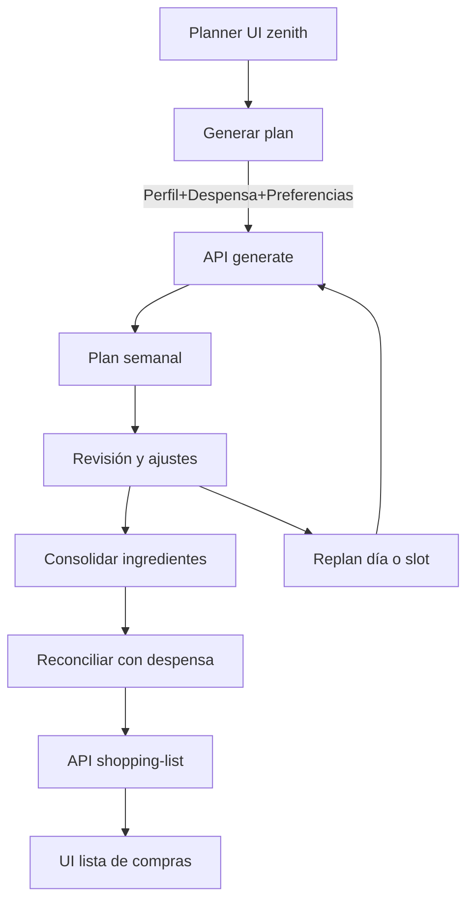

# Planificador de Comidas — Parte 1
Versión: Draft v1
Fecha: 2025-07-31

Contexto: Planner AR/LatAm, 4 comidas diarias (desayuno, almuerzo, merienda, cena), default 7 días escalable a 28. Integración con despensa, preferencias y lista de compras. Generación asistida por Gemini combinando recetas propias y generadas por IA. Referencias explícitas a módulos/endpoints del repo con enlaces clicables.

Fuentes y módulos clave
- UI Planner: [src/app/(app)/planificador/zenith/page.tsx](src/app/(app)/planificador/zenith/page.tsx)
- Generación de planes: [typescript.route()(src/app/api/meal-planning/generate/route.ts:1)
- Reconciliación → Lista de compras: [typescript.route()(src/app/api/meal-planning/shopping-list/route.ts:1)
- UI Lista de compras: [src/app/(app)/shopping-list/page.tsx](src/app/(app)/shopping-list/page.tsx)
- Despensa (items): [typescript.route()(src/app/api/pantry/items/route.ts:1)
- Preferencias de usuario: [typescript.route()(src/app/api/user/preferences/route.ts:1)
- Plan optimizado a despensa: [typescript.route()(src/app/api/meal-planning/pantry-optimized/route.ts:1)
- Check disponibilidad/stock: [typescript.route()(src/app/api/meal-planning/check-availability/route.ts:1)
- Recetas completas: [typescript.route()(src/app/api/recipes/full/route.ts:1)
- IA recetas Gemini: [typescript.route()(src/app/api/ai/recipes/generate/gemini/route.ts:1)

------------------------------------------------------------
Sección A — 20 Perspectivas
10 Tipos de Usuarios

1) Familia con presupuesto ajustado
1) Motivación/Contexto: Alimentar 2–4 personas maximizando ahorro y cero desperdicio; compra semanal en Coto/Día; poco tiempo.
2) Lo convincente: Generación de 7 días usando lo que hay en despensa y ofertas; lista de compras ya reconciliada en ARS.
3) Objeciones/Fricciones: Complejidad inicial; miedo a recetas caras o con ingredientes raros.
4) Mejores UX/UI: Modal de generación con “Presupuesto objetivo ARS/semana”; toggle “Usar primero lo que tengo”; vista de impacto en carrito antes de confirmar; atajo “Sustituir por opción más económica”.

2) Persona sola que busca saludable y rápido
1) Motivación/Contexto: Comer sano sin cocinar largo; porciones para 1; compra en Carrefour Express.
2) Lo convincente: Sugerencias con 20–30 min máx.; batch-cooking ligero; repetición controlada.
3) Objeciones/Fricciones: Teme planes con demasiada variedad que suben costos.
4) Mejores UX/UI: Filtro “Tiempo por comida < 20 min”; slider de variedad; plan 7 días on-boarding, escalar a 28 desde planner con CTA.

3) Pareja joven con horarios variables
1) Motivación/Contexto: Dos personas; cenan tarde; a veces comen afuera.
2) Lo convincente: Replan rápido por día/slot; sustituciones 1-click.
3) Objeciones/Fricciones: Requiere flexibilidad; no quiere editar 28 días manualmente.
4) Mejores UX/UI: Menú contextual sobre slot: “Replan este slot”; duplicar receta a la semana; arrastrar entre días.

4) Hogar con restricciones alimentarias (celiaquía/veggie)
1) Motivación/Contexto: Seguridad y cumplimiento estricto.
2) Lo convincente: Prompt maestro que aplica restricciones del perfil a toda generación.
3) Objeciones/Fricciones: Desconfianza en etiquetado; miedo a errores de IA.
4) Mejores UX/UI: Badge “Sin TACC verificado” y “Veggie estricto”; panel de restricciones visibles en la cabecera; botón “Auditar ingredientes” en revisión.

5) Usuario orientado a fitness/macros
1) Motivación/Contexto: Control de proteínas/carbohidratos/grasas.
2) Lo convincente: Objetivos de macros diarios con rango; autobalanceo semanal.
3) Objeciones/Fricciones: Planes poco consistentes con sus objetivos.
4) Mejores UX/UI: Modo “Macros”: seteo de objetivos; barra de cumplimiento diario/semanal; sugerencias de swaps para ajustar macros.

6) Comprador por ofertas/estacionalidad
1) Motivación/Contexto: Optimizar por precios ARS y estacionalidad.
2) Lo convincente: Recomendaciones por “precio/porción”; prioriza ingredientes en oferta.
3) Objeciones/Fricciones: Datos de precios desactualizados.
4) Mejores UX/UI: Campo “Precio referencia” editable; indicador “Ahorro estimado vs estándar”; botón “Replan con foco ahorro”.

7) Cocinero/a principiante
1) Motivación/Contexto: Necesita recetas simples, pocos pasos.
2) Lo convincente: Dificultad baja, instrucciones claras, fotos.
3) Objeciones/Fricciones: Ansiedad por técnicas desconocidas.
4) Mejores UX/UI: Filtro “Nivel: Fácil”; badges “5 pasos o menos”; tips expandibles por paso.

8) Familias que priorizan variedad niños/adultos
1) Motivación/Contexto: Evitar repetición y conflictos; platos “familiares”.
2) Lo convincente: Variedad con límites; opciones kids-friendly.
3) Objeciones/Fricciones: IA propone combinaciones excéntricas.
4) Mejores UX/UI: Selector “Variedad baja/media/alta”; etiqueta “Kids-friendly”; “no proponer X ingrediente”.

9) Usuario consciente de desperdicio/caducidades
1) Motivación/Contexto: Minimizar tiras de comida y usar lo que vence.
2) Lo convincente: Motor que prioriza fechas de vencimiento.
3) Objeciones/Fricciones: Dudas de precisión de inventario.
4) Mejores UX/UI: Vistas de “A consumir pronto”; botón “Girar menú para aprovechar lo que vence”; diff de impacto en lista.

10) Power user que planifica 28 días
1) Motivación/Contexto: Anticipar todo el mes; compra mensual grande.
2) Lo convincente: Generación por rangos; locking de semanas ya editadas.
3) Objeciones/Fricciones: Mantenimiento de cambios manuales.
4) Mejores UX/UI: Freezer de semana editada; “Aplicar patrón semanal” y luego refinar; comparación de costo mensual.

10 Diseñadores/Expertos

11) Diseñador de conversión
1) Motivación: Reducir TTV en primer uso.
2) Convincente: Default 7 días; wizard minimal.
3) Fricciones: Formularios largos; decisiones opacas.
4) UX/UI: 3 preguntas máximo en primer modal; CTA “Generar ahora, ajustá después”.

12) Diseñador de retención/hábito
1) Motivación: Volver semanalmente.
2) Convincente: Recordatorios suaves; vista “semana lista”.
3) Fricciones: Sobrecarga de notificaciones.
4) UX/UI: Notificación semanal con resumen y “1 click replan”; badge “Plan listo”.

13) Diseñador de accesibilidad
1) Motivación: Lectura y foco.
2) Convincente: Jerarquía clara; contraste; teclado.
3) Fricciones: Tarjetas saturadas.
4) UX/UI: Atajos teclado para slots; tamaños de toque adecuados; descripciones ARIA.

14) Diseñador de contenido/microcopy
1) Motivación: Claridad y guía.
2) Convincente: Copys contextuales, tono local AR.
3) Fricciones: Términos técnicos sin explicación.
4) UX/UI: Glosario tooltip para “reconciliar”, “slot”; microcopys de costo en ARS por porción.

15) Diseñador de interacción
1) Motivación: Flujo natural.
2) Convincente: Drag & drop; menús contextuales.
3) Fricciones: Acciones escondidas.
4) UX/UI: Consistencia entre slot-card y lista lateral; undo/redo.

16) Diseñador de información
1) Motivación: Estructura entendible.
2) Convincente: Calendario semanal claro; capas de detalle progresivas.
3) Fricciones: Datos nutricionales mezclados con precio.
4) UX/UI: Tabs dentro de receta: Ingredientes | Pasos | Nutrición | Precio.

17) Diseñador de economía/compras
1) Motivación: ARS, unidades reales.
2) Convincente: Conversión a unidades de góndola; kilo/litro.
3) Fricciones: Inconsistencias con carrito.
4) UX/UI: Mapeo cantidad receta → unidad compra; vista “equivalencias”.

18) Diseñador de confianza/seguridad
1) Motivación: Evitar errores dañinos.
2) Convincente: Señales de verificación, logs.
3) Fricciones: IA no explicable.
4) UX/UI: “Por qué esta receta aquí” con factores; historial de cambios.

19) Diseñador de internacionalización/localización
1) Motivación: AR/LatAm consistente.
2) Convincente: ARS, cadenas locales, distintos cortes de carne.
3) Fricciones: Unidades anglosajonas mezcladas.
4) UX/UI: Perfil regional; librería de sustituciones locales.

20) Diseñador técnico/arquitectura
1) Motivación: Escalabilidad y trazabilidad.
2) Convincente: Pipeline claro; endpoints separados; logs.
3) Fricciones: Lógica mezclada cliente/servidor.
4) UX/UI: “Debug panel” oculto; IDs de plan/slots; enlaces a endpoints usados en cada acción.

------------------------------------------------------------
Sección B — 5 Conversaciones Simuladas
a) Primeros 5 minutos de uso
Conversación 1
Usuario: Quiero algo rápido y barato para toda la semana.
Diseñador: En [src/app/(app)/planificador/zenith/page.tsx](src/app/(app)/planificador/zenith/page.tsx) el default es 7 días. Activá “Usar lo que tengo” para priorizar despensa. 
Usuario: ¿Me asegura no gastar de más?
Diseñador: La generación usa [typescript.route()(src/app/api/meal-planning/generate/route.ts:1) con preferencias y despensa. Antes de confirmar, ves costo estimado y podés sustituir.

Conversación 2
Usuario: ¿Puedo editar un solo día?
Diseñador: Sí, replan por rango, día o slot desde la UI del calendario. Solo reenvía ese target al endpoint.

Conversación 3
Usuario: Tengo avena y pollo. ¿Los usa?
Diseñador: Sí, leemos despensa vía [typescript.route()(src/app/api/pantry/items/route.ts:1). El prompt maestro privilegia items disponibles y vencimientos.

Conversación 4
Usuario: ¿Y si no me gusta una receta?
Diseñador: En cada tarjeta, “Sustituir” genera alternativas manteniendo restricciones y presupuesto.

Conversación 5
Usuario: ¿Cómo paso a la lista de compras?
Diseñador: Confirmás y generamos orden de necesidades; reconciliamos y creamos lista via [typescript.route()(src/app/api/meal-planning/shopping-list/route.ts:1). La ves en [src/app/(app)/shopping-list/page.tsx](src/app/(app)/shopping-list/page.tsx).

b) Uso a las 2 semanas
Conversación 6
Usuario: Quiero repetir 3 almuerzos y variar las cenas.
Diseñador: Duplicá almuerzos y subí “variedad” para cenas. Guardamos aprendizaje de preferencias.

Conversación 7
Usuario: Bajó mi presupuesto.
Diseñador: Replan con bandera “foco ahorro”; sugerimos swaps de menor costo, mostramos ahorro estimado.

Conversación 8
Usuario: Hay mercadería por vencer.
Diseñador: Activá “consumir antes de” y replan; usa [typescript.route()(src/app/api/meal-planning/pantry-optimized/route.ts:1) y [typescript.route()(src/app/api/meal-planning/check-availability/route.ts:1) para validar stock.

Conversación 9
Usuario: Quiero ajustar macros.
Diseñador: Modo Macros: metas visibles por día, sugerencias de swaps proteicos, barras de cumplimiento.

Conversación 10
Usuario: Quiero 28 días cerrados.
Diseñador: Escalá a 28; bloquea semanas editadas; aplica patrón y refiná excepciones.

------------------------------------------------------------
Sección C — Referencias a Flujos y Arquitectura

Master Prompt compuesto
- Perfil y restricciones: [typescript.route()(src/app/api/user/preferences/route.ts:1)
- Despensa actual: [typescript.route()(src/app/api/pantry/items/route.ts:1)
- Recetas base: propias via [typescript.route()(src/app/api/recipes/full/route.ts:1) + IA via [typescript.route()(src/app/api/ai/recipes/generate/gemini/route.ts:1)
- Parámetros de ejecución (modal): rango (7/14/28, día, slot), prioridad ahorro/variedad/tiempo, macros opcional.

Pipeline de generación y reconciliación
1) Componer prompt y constraints → [typescript.route()(src/app/api/meal-planning/generate/route.ts:1)
2) Guardar/actualizar plan → items por día/slot.
3) Consolidar ingredientes necesarios → agrupar y normalizar unidades.
4) Reconciliar con despensa → diferenciar faltantes vs existentes.
5) Crear/actualizar lista de compras → [typescript.route()(src/app/api/meal-planning/shopping-list/route.ts:1) y UI en [src/app/(app)/shopping-list/page.tsx](src/app/(app)/shopping-list/page.tsx)
6) Opcional: Optimización por despensa/stock → [typescript.route()(src/app/api/meal-planning/pantry-optimized/route.ts:1) y validación en [typescript.route()(src/app/api/meal-planning/check-availability/route.ts:1)

Objetivos UX/UI priorizados
- Onboarding mínimo: default 7 días, 4 slots; “Generar ahora, ajustá después”.
- Replan granular: rango | día | slot con 1–2 clics.
- Revisión clara: costo estimado ARS, tiempo por receta, badges de restricciones.
- Sustituciones asistidas: ahorro, macros, preferencias.
- Lista de compras confiable: unidades y equivalencias, impacto por cambio.

------------------------------------------------------------
Sección D — Diagrama Mermaid (flujo alto nivel)

Notas finales
- Mantener 7 días como default para reducir fricción y escalar a 28 tras primer éxito.
- Guardar aprendizaje de sustituciones y preferencias a futuro.
- Mostrar siempre la trazabilidad: por qué se eligió cada receta, en lenguaje claro.