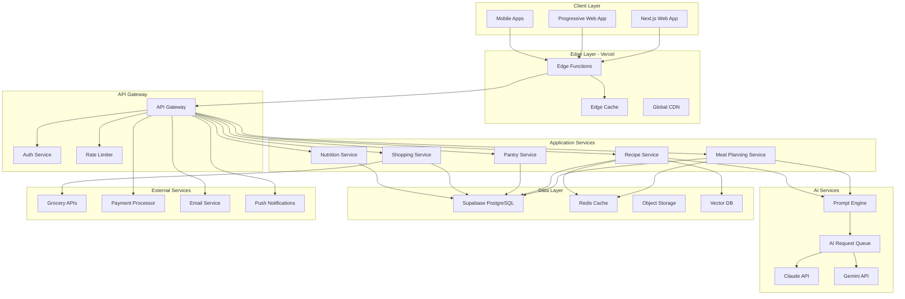
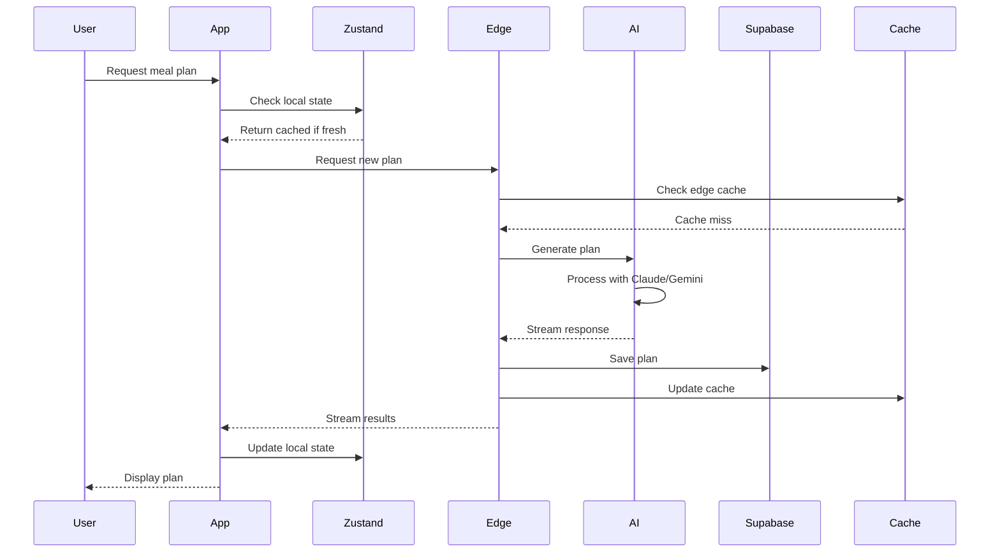

# System Architecture - kecarajocomer
## AI-Powered Meal Planning Platform

**Version**: 2.0  
**Date**: January 2025  
**Stack**: Next.js 15 + Supabase + Vercel + Tailwind + Zustand + Claude/Gemini

---

## Table of Contents
1. [Architecture Overview](#architecture-overview)
2. [System Components](#system-components)
3. [Data Architecture](#data-architecture)
4. [AI Integration Layer](#ai-integration-layer)
5. [State Management](#state-management)
6. [Security Architecture](#security-architecture)
7. [Performance & Scalability](#performance--scalability)
8. [Deployment Architecture](#deployment-architecture)
9. [Monitoring & Observability](#monitoring--observability)

---

## Architecture Overview

### Design Principles
1. **Edge-First**: Leverage edge computing for minimal latency
2. **AI-Native**: Built around AI capabilities, not bolted on
3. **Offline-First**: Core functionality without internet
4. **Privacy-Centric**: User data ownership and control
5. **Composable**: Modular architecture for flexibility
6. **Resilient**: Graceful degradation and self-healing

### High-Level Architecture



---

## System Components

### 1. Frontend Architecture

#### Next.js 15 App Structure
```
app/
├── (public)/
│   ├── page.tsx              # Landing page
│   ├── login/page.tsx        # Authentication
│   └── register/page.tsx     # User registration
├── (authenticated)/
│   ├── dashboard/page.tsx    # Main dashboard
│   ├── planner/
│   │   ├── page.tsx         # Weekly meal planner
│   │   └── [date]/page.tsx  # Daily view
│   ├── recipes/
│   │   ├── page.tsx         # Recipe browser
│   │   ├── [id]/page.tsx    # Recipe detail
│   │   └── create/page.tsx  # AI recipe generator
│   ├── pantry/page.tsx      # Pantry management
│   ├── shopping/page.tsx    # Shopping lists
│   └── nutrition/page.tsx   # Nutritional tracking
├── api/
│   ├── ai/
│   │   ├── generate-meal-plan/route.ts
│   │   ├── suggest-recipe/route.ts
│   │   └── analyze-nutrition/route.ts
│   ├── sync/route.ts        # Offline sync endpoint
│   └── webhooks/
│       ├── stripe/route.ts
│       └── grocery/route.ts
└── layout.tsx               # Root layout with providers
```

#### Component Architecture
```typescript
// Atomic Design Pattern
components/
├── atoms/           # Basic building blocks
│   ├── Button/
│   ├── Input/
│   └── Badge/
├── molecules/       # Combinations of atoms
│   ├── RecipeCard/
│   ├── MealSlot/
│   └── NutritionLabel/
├── organisms/       # Complex components
│   ├── WeekCalendar/
│   ├── RecipeGrid/
│   └── ShoppingList/
├── templates/       # Page templates
│   ├── DashboardLayout/
│   └── AuthLayout/
└── features/        # Feature-specific components
    ├── meal-planner/
    ├── recipe-manager/
    ├── pantry-tracker/
    └── shopping-optimizer/
```

### 2. Backend Services

#### Edge Functions Architecture
```typescript
// Edge Function Example: AI Meal Plan Generation
export const config = {
  runtime: 'edge',
  regions: ['iad1', 'sfo1', 'fra1'], // Multi-region deployment
};

export async function POST(request: Request) {
  // Stream AI responses for better UX
  const stream = new TransformStream();
  const writer = stream.writable.getWriter();
  
  // Non-blocking AI request
  generateMealPlan(request.body).then(async (generator) => {
    for await (const chunk of generator) {
      await writer.write(chunk);
    }
    await writer.close();
  });
  
  return new Response(stream.readable, {
    headers: {
      'Content-Type': 'text/event-stream',
      'Cache-Control': 'no-cache',
    },
  });
}
```

#### Service Layer Design
```typescript
// Domain-Driven Design approach
interface MealPlanningService {
  generateWeeklyPlan(userId: string, preferences: UserPreferences): Promise<WeeklyPlan>;
  adjustPlanForPantry(plan: WeeklyPlan, pantry: PantryInventory): Promise<WeeklyPlan>;
  optimizeForNutrition(plan: WeeklyPlan, goals: NutritionalGoals): Promise<WeeklyPlan>;
  validatePlan(plan: WeeklyPlan): ValidationResult;
}

interface RecipeService {
  searchRecipes(query: RecipeQuery): Promise<Recipe[]>;
  generateAIRecipe(constraints: RecipeConstraints): Promise<Recipe>;
  analyzeNutrition(recipe: Recipe): Promise<NutritionalInfo>;
  scaleRecipe(recipe: Recipe, servings: number): Recipe;
}
```

### 3. Data Flow Architecture



---

## Data Architecture

### Database Schema Design

```sql
-- Core Domain Tables
CREATE TABLE users (
    id UUID PRIMARY KEY DEFAULT gen_random_uuid(),
    email TEXT UNIQUE NOT NULL,
    profile JSONB NOT NULL DEFAULT '{}',
    preferences JSONB NOT NULL DEFAULT '{}',
    created_at TIMESTAMPTZ DEFAULT NOW(),
    updated_at TIMESTAMPTZ DEFAULT NOW()
);

CREATE TABLE recipes (
    id UUID PRIMARY KEY DEFAULT gen_random_uuid(),
    title TEXT NOT NULL,
    description TEXT,
    ingredients JSONB NOT NULL,
    instructions JSONB NOT NULL,
    nutrition JSONB NOT NULL,
    tags TEXT[] DEFAULT '{}',
    ai_generated BOOLEAN DEFAULT FALSE,
    embedding vector(1536), -- For similarity search
    created_by UUID REFERENCES users(id),
    created_at TIMESTAMPTZ DEFAULT NOW()
);

CREATE TABLE meal_plans (
    id UUID PRIMARY KEY DEFAULT gen_random_uuid(),
    user_id UUID REFERENCES users(id) NOT NULL,
    week_start DATE NOT NULL,
    meals JSONB NOT NULL, -- Denormalized for performance
    shopping_list JSONB,
    nutritional_summary JSONB,
    created_at TIMESTAMPTZ DEFAULT NOW(),
    UNIQUE(user_id, week_start)
);

CREATE TABLE pantry_items (
    id UUID PRIMARY KEY DEFAULT gen_random_uuid(),
    user_id UUID REFERENCES users(id) NOT NULL,
    name TEXT NOT NULL,
    quantity DECIMAL,
    unit TEXT,
    expiry_date DATE,
    category TEXT,
    created_at TIMESTAMPTZ DEFAULT NOW(),
    updated_at TIMESTAMPTZ DEFAULT NOW()
);

-- Indexes for performance
CREATE INDEX idx_recipes_embedding ON recipes USING ivfflat (embedding vector_cosine_ops);
CREATE INDEX idx_recipes_tags ON recipes USING GIN (tags);
CREATE INDEX idx_meal_plans_user_week ON meal_plans(user_id, week_start);
CREATE INDEX idx_pantry_items_user_expiry ON pantry_items(user_id, expiry_date);
```

### Data Access Patterns

```typescript
// Repository Pattern with Supabase
class RecipeRepository {
  async findSimilar(embedding: number[], limit: number = 10): Promise<Recipe[]> {
    const { data } = await supabase.rpc('search_recipes', {
      query_embedding: embedding,
      similarity_threshold: 0.8,
      match_count: limit
    });
    return data;
  }
  
  async searchByIngredients(ingredients: string[]): Promise<Recipe[]> {
    const { data } = await supabase
      .from('recipes')
      .select('*')
      .contains('ingredients', ingredients)
      .limit(20);
    return data;
  }
}
```

---

## AI Integration Layer

### Multi-Provider AI Architecture

```typescript
// AI Provider Abstraction
interface AIProvider {
  generateMealPlan(context: MealPlanContext): AsyncGenerator<MealPlanChunk>;
  suggestRecipe(constraints: RecipeConstraints): Promise<Recipe>;
  analyzeNutrition(ingredients: Ingredient[]): Promise<NutritionalInfo>;
}

// Claude Provider Implementation
class ClaudeProvider implements AIProvider {
  private client: Anthropic;
  
  async *generateMealPlan(context: MealPlanContext) {
    const messages = this.buildPrompt(context);
    const stream = await this.client.messages.create({
      model: 'claude-3-opus-20240229',
      messages,
      stream: true,
      max_tokens: 4096,
    });
    
    for await (const chunk of stream) {
      yield this.parseChunk(chunk);
    }
  }
}

// Gemini Provider Implementation
class GeminiProvider implements AIProvider {
  private model: GenerativeModel;
  
  async *generateMealPlan(context: MealPlanContext) {
    const prompt = this.buildPrompt(context);
    const result = await this.model.generateContentStream(prompt);
    
    for await (const chunk of result.stream) {
      yield this.parseChunk(chunk);
    }
  }
}

// AI Service Orchestrator
class AIService {
  private providers: Map<string, AIProvider>;
  private queue: Queue;
  
  async generateWithFallback(request: AIRequest): Promise<AIResponse> {
    try {
      // Try primary provider (Claude)
      return await this.providers.get('claude').generate(request);
    } catch (error) {
      // Fallback to Gemini
      return await this.providers.get('gemini').generate(request);
    }
  }
}
```

### Prompt Engineering System

```typescript
// Structured Prompt Templates
class PromptEngine {
  private templates: Map<string, PromptTemplate>;
  
  buildMealPlanPrompt(context: MealPlanContext): string {
    const template = this.templates.get('meal_plan');
    
    return template.render({
      dietary_restrictions: context.user.restrictions,
      nutritional_goals: context.user.goals,
      available_ingredients: context.pantry.items,
      preferred_cuisines: context.user.cuisines,
      cooking_time: context.constraints.maxCookTime,
      budget: context.constraints.weeklyBudget,
      season: this.getCurrentSeason(),
      previous_meals: context.history.recent(7),
    });
  }
}

// Prompt Template Example
const MEAL_PLAN_TEMPLATE = `
You are a professional nutritionist and meal planner. Generate a weekly meal plan with the following requirements:

USER PROFILE:
- Dietary Restrictions: {{dietary_restrictions}}
- Nutritional Goals: {{nutritional_goals}}
- Preferred Cuisines: {{preferred_cuisines}}

CONSTRAINTS:
- Maximum cooking time per meal: {{cooking_time}} minutes
- Weekly budget: ${{budget}}
- Current season: {{season}}

AVAILABLE INGREDIENTS:
{{#each available_ingredients}}
- {{this.name}}: {{this.quantity}} {{this.unit}}
{{/each}}

AVOID REPETITION OF:
{{#each previous_meals}}
- {{this}}
{{/each}}

Generate a JSON response with this structure:
{
  "monday": { "breakfast": {...}, "lunch": {...}, "dinner": {...} },
  // ... rest of week
}
`;
```

---

## State Management

### Zustand Store Architecture

```typescript
// Root Store Configuration
interface RootState {
  // User State
  user: UserState;
  // Feature States
  mealPlanner: MealPlannerState;
  recipes: RecipeState;
  pantry: PantryState;
  shopping: ShoppingState;
  nutrition: NutritionState;
  // UI State
  ui: UIState;
}

// Meal Planner Store Slice
interface MealPlannerState {
  currentWeek: WeeklyPlan | null;
  selectedDate: Date;
  isDragging: boolean;
  optimisticUpdates: Map<string, Partial<Meal>>;
  
  // Actions
  loadWeeklyPlan: (weekStart: Date) => Promise<void>;
  updateMeal: (date: Date, mealType: MealType, meal: Meal) => void;
  swapMeals: (source: MealSlot, target: MealSlot) => void;
  regenerateMeal: (date: Date, mealType: MealType) => Promise<void>;
  
  // Selectors
  getMealBySlot: (date: Date, mealType: MealType) => Meal | null;
  getWeekNutrition: () => NutritionalSummary;
}

// State Persistence
const mealPlannerStore = create<MealPlannerState>()(
  devtools(
    persist(
      subscribeWithSelector((set, get) => ({
        // State
        currentWeek: null,
        selectedDate: new Date(),
        isDragging: false,
        optimisticUpdates: new Map(),
        
        // Actions with optimistic updates
        updateMeal: (date, mealType, meal) => {
          // Optimistic update
          const key = `${date.toISOString()}-${mealType}`;
          set(state => ({
            optimisticUpdates: new Map(state.optimisticUpdates).set(key, meal)
          }));
          
          // Sync with backend
          api.updateMeal(date, mealType, meal)
            .then(() => {
              // Remove optimistic update on success
              set(state => {
                const updates = new Map(state.optimisticUpdates);
                updates.delete(key);
                return { optimisticUpdates: updates };
              });
            })
            .catch(() => {
              // Revert on failure
              set(state => {
                const updates = new Map(state.optimisticUpdates);
                updates.delete(key);
                return { 
                  optimisticUpdates: updates,
                  currentWeek: state.currentWeek // Trigger re-render
                };
              });
            });
        },
      })),
      {
        name: 'meal-planner-store',
        partialize: (state) => ({ 
          currentWeek: state.currentWeek,
          selectedDate: state.selectedDate 
        }),
      }
    )
  )
);
```

### State Synchronization

```typescript
// Offline-First Sync Manager
class SyncManager {
  private db: IDBDatabase;
  private syncQueue: SyncQueue;
  
  async initialize() {
    this.db = await this.openDatabase();
    this.registerSyncHandler();
  }
  
  async queueOperation(operation: SyncOperation) {
    // Store in IndexedDB
    await this.db.add('sync_queue', operation);
    
    // Try immediate sync if online
    if (navigator.onLine) {
      await this.processSyncQueue();
    }
  }
  
  private async processSyncQueue() {
    const operations = await this.db.getAll('sync_queue');
    
    for (const op of operations) {
      try {
        await this.executeOperation(op);
        await this.db.delete('sync_queue', op.id);
      } catch (error) {
        console.error('Sync failed:', error);
        // Retry with exponential backoff
      }
    }
  }
  
  private registerSyncHandler() {
    if ('serviceWorker' in navigator && 'sync' in registration) {
      navigator.serviceWorker.ready.then(registration => {
        registration.sync.register('sync-data');
      });
    }
  }
}
```

---

## Security Architecture

### Authentication & Authorization

```typescript
// Auth Flow with Supabase
class AuthService {
  private supabase: SupabaseClient;
  
  async signIn(email: string, password: string): Promise<User> {
    const { data, error } = await this.supabase.auth.signInWithPassword({
      email,
      password,
    });
    
    if (error) throw new AuthError(error.message);
    
    // Set secure session
    await this.setSecureSession(data.session);
    
    return data.user;
  }
  
  private async setSecureSession(session: Session) {
    // Store tokens securely
    if (typeof window !== 'undefined') {
      // Web: HttpOnly cookies via API route
      await fetch('/api/auth/session', {
        method: 'POST',
        body: JSON.stringify({ session }),
        credentials: 'include',
      });
    }
  }
}

// Row Level Security Policies
-- Ensure users can only access their own data
CREATE POLICY "Users can view own meal plans"
  ON meal_plans FOR SELECT
  USING (auth.uid() = user_id);

CREATE POLICY "Users can insert own meal plans"
  ON meal_plans FOR INSERT
  WITH CHECK (auth.uid() = user_id);

CREATE POLICY "Users can update own meal plans"
  ON meal_plans FOR UPDATE
  USING (auth.uid() = user_id);
```

### Data Privacy & Encryption

```typescript
// Client-side encryption for sensitive data
class EncryptionService {
  private key: CryptoKey;
  
  async initialize(userKey: string) {
    this.key = await this.deriveKey(userKey);
  }
  
  async encryptSensitiveData(data: any): Promise<EncryptedData> {
    const iv = crypto.getRandomValues(new Uint8Array(12));
    const encoded = new TextEncoder().encode(JSON.stringify(data));
    
    const encrypted = await crypto.subtle.encrypt(
      { name: 'AES-GCM', iv },
      this.key,
      encoded
    );
    
    return {
      data: btoa(String.fromCharCode(...new Uint8Array(encrypted))),
      iv: btoa(String.fromCharCode(...iv)),
    };
  }
  
  async decryptSensitiveData(encrypted: EncryptedData): Promise<any> {
    const data = Uint8Array.from(atob(encrypted.data), c => c.charCodeAt(0));
    const iv = Uint8Array.from(atob(encrypted.iv), c => c.charCodeAt(0));
    
    const decrypted = await crypto.subtle.decrypt(
      { name: 'AES-GCM', iv },
      this.key,
      data
    );
    
    return JSON.parse(new TextDecoder().decode(decrypted));
  }
}
```

---

## Performance & Scalability

### Caching Strategy

```typescript
// Multi-layer caching
class CacheManager {
  private memory: LRUCache;
  private edge: EdgeCache;
  private persistent: IDBCache;
  
  async get(key: string): Promise<any> {
    // L1: Memory cache
    let value = this.memory.get(key);
    if (value) return value;
    
    // L2: Edge cache
    value = await this.edge.get(key);
    if (value) {
      this.memory.set(key, value);
      return value;
    }
    
    // L3: Persistent cache
    value = await this.persistent.get(key);
    if (value) {
      this.memory.set(key, value);
      await this.edge.set(key, value, { ttl: 3600 });
      return value;
    }
    
    return null;
  }
  
  async set(key: string, value: any, options?: CacheOptions) {
    // Write to all layers
    this.memory.set(key, value);
    await this.edge.set(key, value, options);
    await this.persistent.set(key, value);
  }
}

// Edge caching configuration
export const config = {
  matcher: [
    '/api/recipes/:path*',
    '/api/meal-plans/:path*',
  ],
  headers: {
    'Cache-Control': 's-maxage=3600, stale-while-revalidate=86400',
    'CDN-Cache-Control': 'max-age=3600',
  },
};
```

### Performance Optimizations

```typescript
// Image optimization
const RecipeImage = ({ src, alt }: { src: string; alt: string }) => {
  return (
    <Image
      src={src}
      alt={alt}
      width={400}
      height={300}
      sizes="(max-width: 768px) 100vw, (max-width: 1200px) 50vw, 33vw"
      quality={85}
      placeholder="blur"
      blurDataURL={generateBlurDataURL(src)}
      loading="lazy"
    />
  );
};

// Bundle optimization
// next.config.js
module.exports = {
  experimental: {
    optimizeCss: true,
    optimizePackageImports: ['@tanstack/react-query', 'date-fns'],
  },
  modularizeImports: {
    'lucide-react': {
      transform: 'lucide-react/dist/esm/icons/{{member}}',
    },
  },
};

// Code splitting
const RecipeGenerator = dynamic(
  () => import('@/features/recipes/components/AiRecipeGenerator'),
  { 
    loading: () => <RecipeGeneratorSkeleton />,
    ssr: false,
  }
);
```

### Database Performance

```sql
-- Materialized views for complex queries
CREATE MATERIALIZED VIEW weekly_nutrition_summary AS
SELECT 
  user_id,
  week_start,
  SUM((meals->'nutrition'->>'calories')::numeric) as total_calories,
  AVG((meals->'nutrition'->>'protein')::numeric) as avg_protein,
  AVG((meals->'nutrition'->>'carbs')::numeric) as avg_carbs,
  AVG((meals->'nutrition'->>'fat')::numeric) as avg_fat
FROM meal_plans
GROUP BY user_id, week_start;

-- Refresh strategy
CREATE OR REPLACE FUNCTION refresh_nutrition_summary()
RETURNS trigger AS $$
BEGIN
  REFRESH MATERIALIZED VIEW CONCURRENTLY weekly_nutrition_summary;
  RETURN NEW;
END;
$$ LANGUAGE plpgsql;

CREATE TRIGGER refresh_nutrition_after_meal_update
AFTER INSERT OR UPDATE OR DELETE ON meal_plans
FOR EACH STATEMENT EXECUTE FUNCTION refresh_nutrition_summary();
```

---

## Deployment Architecture

### Infrastructure as Code

```yaml
# vercel.json
{
  "functions": {
    "app/api/ai/*": {
      "maxDuration": 60,
      "memory": 3008
    },
    "app/api/sync/*": {
      "maxDuration": 30,
      "memory": 1024
    }
  },
  "crons": [
    {
      "path": "/api/cron/cleanup-expired-items",
      "schedule": "0 2 * * *"
    },
    {
      "path": "/api/cron/generate-weekly-reports",
      "schedule": "0 9 * * 1"
    }
  ],
  "env": {
    "NEXT_PUBLIC_SUPABASE_URL": "@supabase-url",
    "SUPABASE_SERVICE_KEY": "@supabase-service-key",
    "ANTHROPIC_API_KEY": "@anthropic-api-key",
    "GOOGLE_GEMINI_API_KEY": "@gemini-api-key"
  }
}
```

### CI/CD Pipeline

```yaml
# .github/workflows/deploy.yml
name: Deploy to Production

on:
  push:
    branches: [main]

jobs:
  test:
    runs-on: ubuntu-latest
    steps:
      - uses: actions/checkout@v3
      - uses: actions/setup-node@v3
      - run: npm ci
      - run: npm run test:unit
      - run: npm run test:integration
      
  deploy:
    needs: test
    runs-on: ubuntu-latest
    steps:
      - uses: actions/checkout@v3
      - uses: vercel/action@v3
        with:
          vercel-token: ${{ secrets.VERCEL_TOKEN }}
          vercel-args: '--prod'
          
  e2e:
    needs: deploy
    runs-on: ubuntu-latest
    steps:
      - uses: actions/checkout@v3
      - run: npm ci
      - run: npx playwright install
      - run: npm run test:e2e
        env:
          BASE_URL: ${{ secrets.PRODUCTION_URL }}
```

---

## Monitoring & Observability

### Application Monitoring

```typescript
// Error boundary with reporting
class ErrorBoundary extends Component {
  componentDidCatch(error: Error, errorInfo: ErrorInfo) {
    // Log to Sentry
    Sentry.captureException(error, {
      contexts: {
        react: { componentStack: errorInfo.componentStack },
      },
    });
    
    // Log to custom analytics
    analytics.track('error_boundary_triggered', {
      error: error.message,
      stack: error.stack,
      component: errorInfo.componentStack,
    });
  }
}

// Performance monitoring
export function reportWebVitals(metric: Metric) {
  // Send to analytics
  analytics.track('web_vitals', {
    name: metric.name,
    value: metric.value,
    rating: metric.rating,
  });
  
  // Send to monitoring service
  if (metric.label === 'web-vital') {
    sendToMonitoring({
      metric: metric.name,
      value: metric.value,
      tags: {
        rating: metric.rating,
      },
    });
  }
}
```

### Logging Architecture

```typescript
// Structured logging
class Logger {
  private context: LogContext;
  
  constructor(context: LogContext) {
    this.context = context;
  }
  
  info(message: string, data?: any) {
    this.log('info', message, data);
  }
  
  error(message: string, error?: Error, data?: any) {
    this.log('error', message, {
      ...data,
      error: {
        message: error?.message,
        stack: error?.stack,
      },
    });
  }
  
  private log(level: LogLevel, message: string, data?: any) {
    const entry: LogEntry = {
      timestamp: new Date().toISOString(),
      level,
      message,
      context: this.context,
      data,
      trace_id: getTraceId(),
    };
    
    // Send to log aggregation service
    if (typeof window === 'undefined') {
      // Server-side
      console.log(JSON.stringify(entry));
    } else {
      // Client-side
      sendToLogService(entry);
    }
  }
}
```

### Health Checks

```typescript
// API health check endpoint
export async function GET() {
  const checks = await Promise.allSettled([
    checkDatabase(),
    checkRedis(),
    checkAIServices(),
    checkExternalAPIs(),
  ]);
  
  const health = {
    status: checks.every(c => c.status === 'fulfilled') ? 'healthy' : 'degraded',
    timestamp: new Date().toISOString(),
    checks: {
      database: checks[0].status === 'fulfilled' ? 'ok' : 'failed',
      cache: checks[1].status === 'fulfilled' ? 'ok' : 'failed',
      ai: checks[2].status === 'fulfilled' ? 'ok' : 'failed',
      external: checks[3].status === 'fulfilled' ? 'ok' : 'failed',
    },
  };
  
  return NextResponse.json(health, {
    status: health.status === 'healthy' ? 200 : 503,
  });
}
```

---

## Conclusion

This architecture provides a robust, scalable foundation for the kecarajocomer platform that:

1. **Leverages Edge Computing**: Minimal latency with global distribution
2. **AI-First Design**: Seamless integration of multiple AI providers
3. **Offline Capable**: Core features work without connectivity
4. **Performance Optimized**: Sub-3s load times, instant interactions
5. **Secure by Design**: End-to-end encryption, privacy controls
6. **Scalable**: Handles millions of users with horizontal scaling
7. **Observable**: Comprehensive monitoring and debugging

The modular design allows for independent scaling of components while maintaining system coherence through well-defined interfaces and contracts.