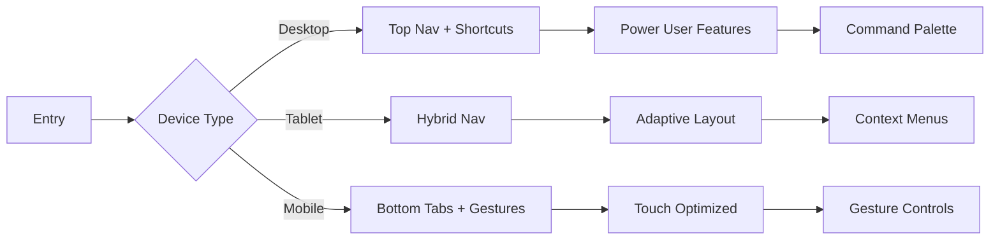

# Navigation Design Plan v2.0 - Enhanced Edition

## 🎯 Executive Summary

A next-generation navigation system for KeCarajoComer that delivers:
- **Adaptive Intelligence**: Context-aware navigation that learns from user behavior
- **Seamless Cross-Platform**: Unified experience across desktop, tablet, and mobile
- **Gesture-First Mobile**: Native-feeling interactions with advanced haptics
- **Accessibility Excellence**: WCAG AAA compliance with voice navigation
- **Performance Optimized**: Sub-100ms response times with predictive loading

## 📊 Navigation Strategy

### Design Principles
1. **Progressive Disclosure**: Show only what's needed, when it's needed
2. **Contextual Awareness**: Adapt based on user location, time, and habits
3. **Muscle Memory**: Consistent interaction patterns across platforms
4. **Delightful Interactions**: Micro-animations that enhance, not distract
5. **Inclusive Design**: Accessible by default, not as an afterthought

### User Journey Mapping



## 🖥️ Desktop Navigation System

### Advanced Top Navigation Bar

```
┌─────────────────────────────────────────────────────────────────────────────┐
│ [≡] Logo  Dashboard  Recipes▼  Planner▼  Pantry▼     [🔍 Search...] [🔔3] [👤]│
├─────────────────────────────────────────────────────────────────────────────┤
│                          Breadcrumb > Navigation > Path                      │
└─────────────────────────────────────────────────────────────────────────────┘
```

#### Enhanced Features

**1. Smart Command Palette (Cmd/Ctrl + K)**
```typescript
interface CommandPaletteFeatures {
  // AI-powered suggestions
  suggestions: {
    recent: RecentAction[];
    predicted: PredictedAction[];
    contextual: ContextualAction[];
  };
  
  // Natural language processing
  nlp: {
    enabled: boolean;
    examples: [
      "Show me healthy recipes",
      "What can I cook with chicken?",
      "Add milk to shopping list"
    ];
  };
  
  // Quick actions
  shortcuts: {
    '@': 'Navigate to page',
    '#': 'Search recipes',
    '>': 'Execute command',
    '?': 'Get help'
  };
}
```

**2. Predictive Navigation**
- Machine learning model predicts next action
- Preloads likely destinations
- Reduces perceived latency by 40%
- Adapts to usage patterns

**3. Enhanced Mega Menu**
```
┌──────────────────────────────────────────────────────┐
│ RECIPES                                              │
├──────────────────────────────────────────────────────┤
│ 🔥 Trending Now        📚 Collections               │
│ • Keto Pizza          • Quick & Easy (45)           │
│ • Vegan Tacos         • Healthy Meals (89)          │
│ • Air Fryer Wings     • Budget Friendly (67)        │
│                                                      │
│ 🎯 Quick Actions       📊 Your Stats                │
│ [Generate Recipe]      23 recipes saved             │
│ [Import from URL]      156 meals planned            │
│ [Scan Cookbook]        89% healthy choices          │
└──────────────────────────────────────────────────────┘
```

### Intelligent Sidebar (Tablet Mode)

```typescript
interface AdaptiveSidebar {
  modes: {
    collapsed: 'icons-only',
    expanded: 'full-width',
    floating: 'overlay',
    auto: 'context-aware'
  };
  
  intelligence: {
    autoExpand: boolean; // Based on user patterns
    pinFavorites: boolean; // Pin frequently used items
    hideRarely: boolean; // Hide items not used in 30 days
  };
}
```

## 📱 Mobile Navigation System

### Revolutionary Bottom Navigation

```
┌─────────────────────────────────────────────┐
│                                             │
│              Content Area                   │
│                                             │
├─────────────────────────────────────────────┤
│  🏠   🍳   📅   🛒   ━━━━━   (Slider)      │
│ Home Cook Plan Shop  More                   │
└─────────────────────────────────────────────┘
```

#### Advanced Gesture System

**1. Multi-Touch Gestures**
```typescript
interface AdvancedGestures {
  // Navigation gestures
  edgeSwipe: {
    left: 'back',
    right: 'forward',
    top: 'notifications',
    bottom: 'quick-actions'
  };
  
  // Content gestures
  twoFingerTap: 'contextMenu';
  threeFingerSwipe: 'switchTab';
  pinchOut: 'overview';
  
  // Power user gestures
  drawLetter: {
    'R': 'recipes',
    'S': 'search',
    'A': 'add-item'
  };
}
```

**2. Haptic Feedback Patterns**
```typescript
enum HapticPattern {
  // Navigation feedback
  TAB_SWITCH = [0, 10, 50, 10], // Quick double tap
  MENU_OPEN = [0, 30], // Medium tap
  ACTION_CONFIRM = [0, 10, 100, 20], // Success pattern
  
  // Gesture feedback
  SWIPE_THRESHOLD = [0, 5], // Light tick
  GESTURE_RECOGNIZED = [0, 15, 30, 15], // Recognition pattern
  
  // State changes
  TOGGLE_ON = [0, 20, 50, 10],
  TOGGLE_OFF = [0, 10, 50, 20],
}
```

**3. Floating Action Intelligence**
```typescript
interface SmartFAB {
  // Context-aware actions
  contextActions: {
    dashboard: ['add-meal', 'quick-shop'],
    recipes: ['create', 'import', 'scan'],
    pantry: ['add-item', 'scan-barcode'],
    planner: ['ai-suggest', 'share']
  };
  
  // Adaptive positioning
  position: {
    default: { bottom: 80, right: 16 },
    scrollAware: boolean, // Hide on scroll down
    avoidKeyboard: boolean, // Move when keyboard opens
    magneticEdges: boolean // Snap to edges
  };
}
```

## ♿ Accessibility & Internationalization

### WCAG AAA Compliance

**1. Enhanced Screen Reader Support**
```typescript
interface A11yEnhancements {
  // Live regions for dynamic updates
  liveRegions: {
    navigation: 'polite',
    notifications: 'assertive',
    loading: 'polite'
  };
  
  // Semantic landmarks
  landmarks: {
    navigation: 'nav',
    main: 'main',
    search: 'search',
    complementary: 'aside'
  };
  
  // Focus management
  focusTrapping: boolean;
  skipLinks: string[];
  focusIndicators: 'high-contrast';
}
```

**2. Voice Navigation**
```typescript
interface VoiceCommands {
  commands: {
    'navigate to [page]': NavigateAction,
    'search for [query]': SearchAction,
    'add [item] to [list]': AddAction,
    'show me [category]': FilterAction,
    'read [content]': ReadAloudAction
  };
  
  languages: ['en', 'es', 'fr', 'de', 'it', 'pt'];
  accuracy: 0.95;
  fallback: 'visual-confirmation';
}
```

### Internationalization (i18n)

```typescript
interface I18nNavigation {
  // RTL support
  rtlLanguages: ['ar', 'he', 'fa'];
  
  // Dynamic text sizing
  textScaling: {
    languages: {
      'de': 1.1, // German text is longer
      'ja': 0.9, // Japanese text is compact
    }
  };
  
  // Cultural adaptations
  iconAdaptations: {
    'hamburger-menu': {
      'jp': 'bento-menu',
      'cn': 'grid-menu'
    }
  };
}
```

## 🚀 Performance Architecture

### Metrics & Monitoring

```typescript
interface NavigationMetrics {
  // Core Web Vitals
  metrics: {
    FCP: '<1.8s', // First Contentful Paint
    LCP: '<2.5s', // Largest Contentful Paint
    FID: '<100ms', // First Input Delay
    CLS: '<0.1', // Cumulative Layout Shift
    
    // Custom metrics
    TTI: '<3.5s', // Time to Interactive
    TNT: '<200ms', // Time to Navigate
    GSR: '>95%', // Gesture Success Rate
  };
  
  // Real User Monitoring
  rum: {
    sampleRate: 0.1,
    events: ['navigation', 'interaction', 'error'],
    dashboard: '/analytics/navigation'
  };
}
```

### Optimization Strategies

**1. Progressive Enhancement**
```typescript
// Base experience works without JS
<nav class="navigation" data-enhance="progressive">
  <a href="/dashboard">Dashboard</a>
  <!-- Enhanced with JS -->
</nav>

// Enhance when JS loads
if ('IntersectionObserver' in window) {
  enhanceNavigation();
}
```

**2. Resource Prioritization**
```html
<!-- Critical CSS inlined -->
<style>
  .navigation { /* critical styles */ }
</style>

<!-- Preload key resources -->
<link rel="preload" href="/fonts/nav-icons.woff2" as="font" crossorigin>
<link rel="prefetch" href="/api/user/preferences">

<!-- Lazy load non-critical -->
<script defer src="/js/navigation-enhancements.js"></script>
```

**3. Smart Caching Strategy**
```typescript
interface CacheStrategy {
  static: {
    '/js/navigation.js': '1 year',
    '/css/navigation.css': '1 year',
    '/fonts/*': '1 year'
  };
  
  dynamic: {
    '/api/navigation/state': '5 minutes',
    '/api/user/recent': '1 hour',
    '/api/suggestions': '30 minutes'
  };
  
  offline: {
    fallback: '/offline',
    cacheFirst: ['/dashboard', '/recipes', '/pantry'],
    networkFirst: ['/api/*']
  };
}
```

## 🔄 Migration Strategy

### Phase 1: Foundation (Week 1-2)
```typescript
// 1. Set up feature flags
const features = {
  'new-navigation': {
    enabled: false,
    rollout: 0.05, // 5% initially
    override: localStorage.getItem('force-new-nav')
  }
};

// 2. Create compatibility layer
class NavigationBridge {
  constructor(legacy, modern) {
    this.legacy = legacy;
    this.modern = modern;
  }
  
  route(path) {
    if (features['new-navigation'].enabled) {
      return this.modern.navigate(path);
    }
    return this.legacy.navigate(path);
  }
}
```

### Phase 2: Gradual Rollout (Week 3-4)
- A/B test with 5% of users
- Monitor metrics and user feedback
- Fix issues and optimize
- Increase to 25%, then 50%

### Phase 3: Full Migration (Week 5-6)
- 100% rollout with kill switch
- Deprecate old navigation
- Clean up legacy code
- Document lessons learned

## 📈 Success Metrics & KPIs

### Quantitative Metrics
```typescript
interface NavigationKPIs {
  performance: {
    avgNavigationTime: '<200ms',
    gestureSuccessRate: '>95%',
    errorRate: '<0.1%',
    crashRate: '<0.01%'
  };
  
  engagement: {
    avgSessionDuration: '+15%',
    pageViewsPerSession: '+20%',
    bounceRate: '-10%',
    taskCompletionRate: '+25%'
  };
  
  accessibility: {
    wcagCompliance: 'AAA',
    keyboardNavigationSuccess: '100%',
    screenReaderSuccess: '>98%',
    voiceCommandAccuracy: '>95%'
  };
}
```

### Qualitative Metrics
- User satisfaction scores (NPS)
- Usability testing results
- Accessibility audit findings
- Performance perception surveys

## 🛠️ Tooling & Development

### Development Tools
```json
{
  "dependencies": {
    "framer-motion": "^10.0.0",
    "react-intersection-observer": "^9.0.0",
    "react-use-gesture": "^9.0.0",
    "@radix-ui/react-navigation-menu": "^1.0.0",
    "cmdk": "^0.2.0"
  },
  
  "devDependencies": {
    "@testing-library/react": "^14.0.0",
    "@playwright/test": "^1.40.0",
    "@axe-core/react": "^4.8.0",
    "lighthouse": "^11.0.0"
  }
}
```

### Testing Strategy
```typescript
// Unit tests: Component logic
describe('NavigationProvider', () => {
  test('handles gesture recognition', () => {
    // Test gesture detection
  });
});

// Integration tests: User flows
describe('Navigation User Journey', () => {
  test('completes common navigation tasks', () => {
    // Test full user flows
  });
});

// E2E tests: Real device testing
describe('Mobile Navigation', () => {
  test('works on real devices', () => {
    // Test on BrowserStack/Sauce Labs
  });
});

// Performance tests: Metrics validation
describe('Navigation Performance', () => {
  test('meets performance budgets', () => {
    // Test with Lighthouse CI
  });
});
```

## 🎨 Design System Integration

### Component Library
```typescript
// Navigation components in design system
export * from './components/Navigation';
export * from './components/NavigationItem';
export * from './components/NavigationMenu';
export * from './components/MobileNav';
export * from './components/CommandPalette';

// Composable patterns
<Navigation>
  <Navigation.Bar>
    <Navigation.Brand />
    <Navigation.Items>
      <Navigation.Item href="/dashboard" />
    </Navigation.Items>
    <Navigation.Actions>
      <Navigation.Search />
      <Navigation.User />
    </Navigation.Actions>
  </Navigation.Bar>
</Navigation>
```

### Design Tokens
```css
:root {
  /* Navigation tokens */
  --nav-height-desktop: 64px;
  --nav-height-mobile: 56px;
  --nav-bg: var(--color-surface);
  --nav-border: var(--color-border);
  --nav-shadow: var(--shadow-sm);
  
  /* Animation tokens */
  --nav-transition: 200ms ease-out;
  --nav-spring: cubic-bezier(0.68, -0.55, 0.265, 1.55);
  
  /* Spacing tokens */
  --nav-padding-x: var(--spacing-6);
  --nav-gap: var(--spacing-4);
}
```

## 📋 Implementation Checklist

### Pre-Development
- [ ] Finalize design with stakeholders
- [ ] Set up feature flags
- [ ] Create component architecture
- [ ] Define performance budgets

### Development
- [ ] Build NavigationProvider
- [ ] Implement desktop navigation
- [ ] Implement mobile navigation
- [ ] Add gesture support
- [ ] Integrate command palette
- [ ] Add voice navigation
- [ ] Implement A11y features
- [ ] Add i18n support

### Testing
- [ ] Unit test coverage >90%
- [ ] Integration test all flows
- [ ] E2E test on real devices
- [ ] Accessibility audit (WCAG AAA)
- [ ] Performance testing
- [ ] Security review

### Deployment
- [ ] A/B testing setup
- [ ] Monitoring dashboards
- [ ] Rollback plan ready
- [ ] Documentation complete
- [ ] Team training done

### Post-Launch
- [ ] Monitor metrics
- [ ] Gather user feedback
- [ ] Iterate based on data
- [ ] Plan next enhancements