# 🎯 Plan de Implementación Autónomo - KeCarajoComér v2.0

## 🌟 Visión Holística del Sistema

```mermaid
graph TB
    subgraph "Entrada de Datos"
        A[Scanner de Tickets] --> B[Parser Inteligente]
        C[Cámara/OCR] --> B
        D[Voz] --> B
        E[Manual] --> B
    end
    
    subgraph "Procesamiento Central"
        B --> F[Motor de IA]
        F --> G[Base de Datos]
        G --> H[Sistema de Aprendizaje]
    end
    
    subgraph "Salida Inteligente"
        H --> I[Planificador de Comidas]
        H --> J[Lista de Compras]
        H --> K[Recomendaciones]
        I --> L[Usuario Feliz 🎉]
    end
```



## 🏗️ Fases de Implementación Autónoma

### FASE 0: Setup y Fundación (48 horas)
```bash
# Script de inicialización automática
#!/bin/bash
# setup-kecarajocomer.sh

echo "🚀 Iniciando setup de KeCarajoComér v2.0..."

# 1. Crear estructura del proyecto
npx create-next-app@latest kecarajocomer --typescript --tailwind --app

# 2. Instalar dependencias core
cd kecarajocomer
npm install @supabase/supabase-js @tanstack/react-query zustand framer-motion
npm install react-hook-form zod @radix-ui/react-* lucide-react
npm install -D @types/node eslint prettier

# 3. Configurar Supabase
npx supabase init
npx supabase start

# 4. Aplicar migraciones
npx supabase db push

echo "✅ Setup completado!"
```

### FASE 1: Infraestructura Base (Semana 1)

#### 1.1 Base de Datos Holística
```sql
-- migrations/001_holistic_schema.sql

-- Tabla central de usuarios con preferencias
CREATE TABLE profiles (
    id UUID PRIMARY KEY DEFAULT gen_random_uuid(),
    user_id UUID REFERENCES auth.users NOT NULL,
    
    -- Preferencias dietéticas
    dietary_restrictions JSONB DEFAULT '[]',
    allergies TEXT[] DEFAULT '{}',
    preferred_cuisines TEXT[] DEFAULT '{}',
    disliked_ingredients TEXT[] DEFAULT '{}',
    
    -- Datos del hogar
    household_size INT DEFAULT 1,
    household_members JSONB DEFAULT '[]',
    
    -- Presupuesto y objetivos
    monthly_budget DECIMAL(10,2),
    nutritional_goals JSONB DEFAULT '{}',
    
    -- Metadatos de aprendizaje
    taste_profile JSONB DEFAULT '{}',
    cooking_skill_level INT DEFAULT 1,
    
    created_at TIMESTAMPTZ DEFAULT NOW(),
    updated_at TIMESTAMPTZ DEFAULT NOW()
);

-- Tabla de ingredientes con datos nutricionales
CREATE TABLE ingredients (
    id UUID PRIMARY KEY DEFAULT gen_random_uuid(),
    name TEXT NOT NULL,
    name_normalized TEXT NOT NULL,
    
    -- Categorización
    category TEXT NOT NULL,
    subcategory TEXT,
    
    -- Datos nutricionales por 100g
    nutrition JSONB NOT NULL DEFAULT '{}',
    
    -- Metadatos
    common_units JSONB DEFAULT '[]',
    average_price DECIMAL(10,2),
    seasonality JSONB DEFAULT '{}',
    
    -- Vectores para búsqueda semántica
    embedding vector(1536),
    
    created_at TIMESTAMPTZ DEFAULT NOW()
);

-- Tabla de recetas enriquecida
CREATE TABLE recipes (
    id UUID PRIMARY KEY DEFAULT gen_random_uuid(),
    
    -- Información básica
    title TEXT NOT NULL,
    description TEXT,
    
    -- Ingredientes con cantidades
    ingredients JSONB NOT NULL,
    
    -- Instrucciones estructuradas
    instructions JSONB NOT NULL,
    
    -- Metadatos
    prep_time INT,
    cook_time INT,
    difficulty INT CHECK (difficulty BETWEEN 1 AND 5),
    servings INT DEFAULT 4,
    
    -- Información nutricional calculada
    nutrition_per_serving JSONB,
    
    -- Costos
    estimated_cost DECIMAL(10,2),
    cost_per_serving DECIMAL(10,2),
    
    -- IA y personalización
    ai_generated BOOLEAN DEFAULT FALSE,
    generation_params JSONB,
    
    -- Vectores para recomendaciones
    flavor_profile JSONB,
    embedding vector(1536),
    
    created_at TIMESTAMPTZ DEFAULT NOW()
);

-- Tabla de despensa inteligente
CREATE TABLE pantry_items (
    id UUID PRIMARY KEY DEFAULT gen_random_uuid(),
    user_id UUID REFERENCES profiles(id) ON DELETE CASCADE,
    ingredient_id UUID REFERENCES ingredients(id),
    
    -- Cantidades
    quantity DECIMAL(10,2) NOT NULL,
    unit TEXT NOT NULL,
    
    -- Fechas
    purchase_date DATE DEFAULT CURRENT_DATE,
    expiration_date DATE,
    
    -- Estado
    status TEXT DEFAULT 'available',
    location TEXT DEFAULT 'pantry',
    
    -- Tracking de uso
    usage_history JSONB DEFAULT '[]',
    
    created_at TIMESTAMPTZ DEFAULT NOW(),
    updated_at TIMESTAMPTZ DEFAULT NOW()
);

-- Tabla de tickets escaneados
CREATE TABLE scanned_receipts (
    id UUID PRIMARY KEY DEFAULT gen_random_uuid(),
    user_id UUID REFERENCES profiles(id) ON DELETE CASCADE,
    
    -- Datos del escaneo
    image_url TEXT,
    ocr_raw_text TEXT,
    parsed_data JSONB,
    
    -- Items detectados
    detected_items JSONB DEFAULT '[]',
    
    -- Metadatos
    store_name TEXT,
    purchase_date TIMESTAMPTZ,
    total_amount DECIMAL(10,2),
    
    -- Estado del procesamiento
    processing_status TEXT DEFAULT 'pending',
    confidence_score DECIMAL(3,2),
    
    created_at TIMESTAMPTZ DEFAULT NOW()
);

-- Tabla de planes de comida
CREATE TABLE meal_plans (
    id UUID PRIMARY KEY DEFAULT gen_random_uuid(),
    user_id UUID REFERENCES profiles(id) ON DELETE CASCADE,
    
    -- Período
    start_date DATE NOT NULL,
    end_date DATE NOT NULL,
    
    -- Comidas planificadas
    meals JSONB NOT NULL DEFAULT '{}',
    
    -- Análisis nutricional agregado
    nutrition_summary JSONB,
    
    -- Costos
    estimated_cost DECIMAL(10,2),
    
    -- Estado
    status TEXT DEFAULT 'draft',
    
    created_at TIMESTAMPTZ DEFAULT NOW(),
    updated_at TIMESTAMPTZ DEFAULT NOW()
);

-- Tabla de listas de compras inteligentes
CREATE TABLE shopping_lists (
    id UUID PRIMARY KEY DEFAULT gen_random_uuid(),
    user_id UUID REFERENCES profiles(id) ON DELETE CASCADE,
    meal_plan_id UUID REFERENCES meal_plans(id),
    
    -- Items agrupados por categoría
    items JSONB NOT NULL DEFAULT '{}',
    
    -- Optimización
    store_routing JSONB,
    estimated_total DECIMAL(10,2),
    
    -- Estado
    status TEXT DEFAULT 'pending',
    completed_at TIMESTAMPTZ,
    
    created_at TIMESTAMPTZ DEFAULT NOW()
);

-- Índices para búsqueda rápida
CREATE INDEX idx_ingredients_embedding ON ingredients USING ivfflat (embedding vector_cosine_ops);
CREATE INDEX idx_recipes_embedding ON recipes USING ivfflat (embedding vector_cosine_ops);
CREATE INDEX idx_pantry_user_status ON pantry_items(user_id, status);
CREATE INDEX idx_meal_plans_user_date ON meal_plans(user_id, start_date, end_date);

-- Funciones para el sistema holístico
CREATE OR REPLACE FUNCTION calculate_recipe_nutrition(recipe_ingredients JSONB)
RETURNS JSONB AS $$
DECLARE
    total_nutrition JSONB := '{}';
    item JSONB;
BEGIN
    -- Calcular nutrición total basada en ingredientes
    FOR item IN SELECT * FROM jsonb_array_elements(recipe_ingredients)
    LOOP
        -- Lógica de cálculo aquí
    END LOOP;
    
    RETURN total_nutrition;
END;
$$ LANGUAGE plpgsql;

-- Trigger para actualizar embeddings
CREATE OR REPLACE FUNCTION update_embeddings()
RETURNS TRIGGER AS $$
BEGIN
    -- Llamar a edge function para generar embeddings
    PERFORM net.http_post(
        url := 'https://api.openai.com/v1/embeddings',
        headers := jsonb_build_object('Authorization', 'Bearer ' || current_setting('app.openai_key')),
        body := jsonb_build_object('input', NEW.title || ' ' || NEW.description, 'model', 'text-embedding-ada-002')
    );
    RETURN NEW;
END;
$$ LANGUAGE plpgsql;
```

#### 1.2 Servicios Core Holísticos
```typescript
// src/services/core/HolisticSystem.ts

import { createClient } from '@supabase/supabase-js';
import { OpenAI } from 'openai';
import { z } from 'zod';

/**
 * Sistema Holístico Central
 * Conecta todos los subsistemas de manera inteligente
 */
export class HolisticFoodSystem {
  private supabase = createClient(process.env.SUPABASE_URL!, process.env.SUPABASE_KEY!);
  private openai = new OpenAI({ apiKey: process.env.OPENAI_API_KEY! });
  
  // Subsistemas
  private scanner = new ReceiptScanner(this);
  private pantryManager = new PantryManager(this);
  private mealPlanner = new MealPlanner(this);
  private aiChef = new AIChef(this);
  private shoppingOptimizer = new ShoppingOptimizer(this);
  
  /**
   * Flujo completo: Ticket → Despensa → Plan → Lista
   */
  async processReceiptToMealPlan(receiptImage: File, userId: string) {
    try {
      // 1. Escanear ticket
      console.log('🔍 Escaneando ticket...');
      const scannedItems = await this.scanner.scanReceipt(receiptImage);
      
      // 2. Actualizar despensa
      console.log('📦 Actualizando despensa...');
      const pantryUpdate = await this.pantryManager.addItemsFromReceipt(scannedItems, userId);
      
      // 3. Analizar estado actual
      console.log('🧠 Analizando estado de despensa...');
      const pantryAnalysis = await this.pantryManager.analyzePantryState(userId);
      
      // 4. Generar plan de comidas optimizado
      console.log('📅 Generando plan de comidas...');
      const mealPlan = await this.mealPlanner.generateOptimalPlan({
        userId,
        pantryState: pantryAnalysis,
        preferences: await this.getUserPreferences(userId),
        duration: 7 // días
      });
      
      // 5. Crear lista de compras inteligente
      console.log('🛒 Creando lista de compras...');
      const shoppingList = await this.shoppingOptimizer.generateSmartList({
        mealPlan,
        currentPantry: pantryAnalysis,
        budget: await this.getUserBudget(userId)
      });
      
      return {
        scannedItems,
        pantryUpdate,
        mealPlan,
        shoppingList,
        insights: await this.generateInsights(userId, mealPlan)
      };
      
    } catch (error) {
      console.error('Error en procesamiento holístico:', error);
      throw error;
    }
  }
  
  /**
   * Genera insights personalizados basados en el comportamiento
   */
  private async generateInsights(userId: string, mealPlan: MealPlan) {
    const prompt = `
      Analiza este plan de comidas y genera 3 insights personalizados:
      ${JSON.stringify(mealPlan)}
      
      Considera:
      - Balance nutricional
      - Variedad de ingredientes
      - Costo estimado
      - Tiempo de preparación
    `;
    
    const response = await this.openai.chat.completions.create({
      model: 'gpt-4',
      messages: [{ role: 'user', content: prompt }],
      temperature: 0.7
    });
    
    return response.choices[0].message.content;
  }
}

/**
 * Scanner de Tickets Inteligente
 */
class ReceiptScanner {
  constructor(private system: HolisticFoodSystem) {}
  
  async scanReceipt(image: File): Promise<ScannedItem[]> {
    // 1. OCR con Tesseract o Google Vision
    const ocrText = await this.performOCR(image);
    
    // 2. Parsear con IA
    const parsedItems = await this.parseWithAI(ocrText);
    
    // 3. Enriquecer con base de datos
    const enrichedItems = await this.enrichItems(parsedItems);
    
    // 4. Validar y corregir
    return this.validateAndCorrect(enrichedItems);
  }
  
  private async performOCR(image: File): Promise<string> {
    // Implementación de OCR
    const formData = new FormData();
    formData.append('image', image);
    
    const response = await fetch('/api/ocr', {
      method: 'POST',
      body: formData
    });
    
    return response.text();
  }
  
  private async parseWithAI(text: string): Promise<ParsedItem[]> {
    const prompt = `
      Extrae los items de este ticket de compra:
      ${text}
      
      Formato JSON:
      [{
        "name": "nombre del producto",
        "quantity": cantidad,
        "unit": "unidad",
        "price": precio
      }]
    `;
    
    const response = await this.system['openai'].chat.completions.create({
      model: 'gpt-4',
      messages: [{ role: 'user', content: prompt }],
      response_format: { type: 'json_object' }
    });
    
    return JSON.parse(response.choices[0].message.content!).items;
  }
}

/**
 * Gestor de Despensa Inteligente
 */
class PantryManager {
  constructor(private system: HolisticFoodSystem) {}
  
  async analyzePantryState(userId: string): Promise<PantryAnalysis> {
    // Obtener items actuales
    const { data: items } = await this.system['supabase']
      .from('pantry_items')
      .select('*, ingredient:ingredients(*)')
      .eq('user_id', userId)
      .eq('status', 'available');
    
    return {
      totalItems: items?.length || 0,
      expiringItems: this.getExpiringItems(items),
      lowStockItems: this.getLowStockItems(items),
      nutritionalProfile: this.calculateNutritionalProfile(items),
      estimatedMeals: this.estimatePossibleMeals(items)
    };
  }
  
  private getExpiringItems(items: any[]): ExpiringItem[] {
    const threeDaysFromNow = new Date();
    threeDaysFromNow.setDate(threeDaysFromNow.getDate() + 3);
    
    return items
      .filter(item => new Date(item.expiration_date) <= threeDaysFromNow)
      .map(item => ({
        ...item,
        daysUntilExpiration: Math.ceil(
          (new Date(item.expiration_date).getTime() - Date.now()) / (1000 * 60 * 60 * 24)
        )
      }));
  }
}

/**
 * Planificador de Comidas con IA
 */
class MealPlanner {
  constructor(private system: HolisticFoodSystem) {}
  
  async generateOptimalPlan(params: PlanParams): Promise<MealPlan> {
    const { userId, pantryState, preferences, duration } = params;
    
    // 1. Generar restricciones
    const constraints = this.buildConstraints(preferences, pantryState);
    
    // 2. Optimizar plan con múltiples objetivos
    const plan = await this.optimizePlan({
      objectives: [
        'maximize_pantry_usage',
        'minimize_cost',
        'maximize_nutrition',
        'maximize_variety'
      ],
      constraints,
      duration
    });
    
    // 3. Validar y ajustar
    return this.validateAndAdjust(plan, preferences);
  }
  
  private async optimizePlan(params: OptimizationParams): Promise<RawMealPlan> {
    // Usar algoritmo de optimización multi-objetivo
    // Puede ser programación lineal, algoritmos genéticos, o IA
    
    const prompt = `
      Genera un plan de comidas óptimo con estos parámetros:
      ${JSON.stringify(params)}
      
      El plan debe:
      - Usar máximo los ingredientes disponibles
      - Minimizar compras adicionales
      - Balancear nutrición
      - Variar los platos
    `;
    
    const response = await this.system['openai'].chat.completions.create({
      model: 'gpt-4',
      messages: [{ role: 'user', content: prompt }],
      temperature: 0.8
    });
    
    return JSON.parse(response.choices[0].message.content!);
  }
}

/**
 * Optimizador de Lista de Compras
 */
class ShoppingOptimizer {
  constructor(private system: HolisticFoodSystem) {}
  
  async generateSmartList(params: ShoppingParams): Promise<ShoppingList> {
    const { mealPlan, currentPantry, budget } = params;
    
    // 1. Calcular ingredientes necesarios
    const required = this.calculateRequiredIngredients(mealPlan);
    
    // 2. Restar lo que ya tenemos
    const toBuy = this.subtractPantryItems(required, currentPantry);
    
    // 3. Optimizar por tienda y precio
    const optimized = await this.optimizeByStoreAndPrice(toBuy, budget);
    
    // 4. Organizar por secciones
    return this.organizeByStoreSections(optimized);
  }
  
  private async optimizeByStoreAndPrice(items: RequiredItem[], budget: number) {
    // Consultar precios en diferentes tiendas
    const storePrices = await this.fetchStorePrices(items);
    
    // Algoritmo de optimización
    // Puede usar programación dinámica para el problema de la mochila
    return this.runOptimizationAlgorithm(storePrices, budget);
  }
}
```

### FASE 2: Componentes UI Inteligentes (Semana 2)

#### 2.1 Scanner Component
```typescript
// src/components/scanner/SmartScanner.tsx

import React, { useState, useCallback } from 'react';
import { Camera, Upload, Mic } from 'lucide-react';
import { useHolisticSystem } from '@/hooks/useHolisticSystem';
import { iOS26Button } from '@/components/ui/iOS26Button';
import { motion, AnimatePresence } from 'framer-motion';

export function SmartScanner() {
  const [mode, setMode] = useState<'camera' | 'upload' | 'voice'>('camera');
  const [isProcessing, setIsProcessing] = useState(false);
  const { processReceipt } = useHolisticSystem();
  
  const handleScan = useCallback(async (input: File | string) => {
    setIsProcessing(true);
    
    try {
      // Procesar con sistema holístico
      const result = await processReceipt(input);
      
      // Mostrar resultados con animación
      showResults(result);
      
    } catch (error) {
      console.error('Error en escaneo:', error);
    } finally {
      setIsProcessing(false);
    }
  }, [processReceipt]);
  
  return (
    <motion.div 
      className="relative"
      initial={{ opacity: 0, y: 20 }}
      animate={{ opacity: 1, y: 0 }}
    >
      {/* Selector de modo */}
      <div className="flex gap-2 mb-6">
        {[
          { id: 'camera', icon: Camera, label: 'Cámara' },
          { id: 'upload', icon: Upload, label: 'Subir' },
          { id: 'voice', icon: Mic, label: 'Voz' }
        ].map((option) => (
          <iOS26Button
            key={option.id}
            variant={mode === option.id ? 'elevated' : 'outlined'}
            onClick={() => setMode(option.id as any)}
            className="flex-1"
          >
            <option.icon className="w-5 h-5 mr-2" />
            {option.label}
          </iOS26Button>
        ))}
      </div>
      
      {/* Scanner Interface */}
      <AnimatePresence mode="wait">
        {mode === 'camera' && <CameraScanner onCapture={handleScan} />}
        {mode === 'upload' && <FileUploader onUpload={handleScan} />}
        {mode === 'voice' && <VoiceRecorder onRecord={handleScan} />}
      </AnimatePresence>
      
      {/* Processing Overlay */}
      {isProcessing && (
        <motion.div
          initial={{ opacity: 0 }}
          animate={{ opacity: 1 }}
          className="absolute inset-0 bg-black/50 backdrop-blur-xl flex items-center justify-center"
        >
          <div className="text-center">
            <div className="w-16 h-16 border-4 border-orange-500 border-t-transparent rounded-full animate-spin mb-4" />
            <p className="text-white font-medium">Procesando con IA...</p>
          </div>
        </motion.div>
      )}
    </motion.div>
  );
}
```

#### 2.2 Pantry Dashboard Holístico
```typescript
// src/components/pantry/HolisticPantryDashboard.tsx

import React from 'react';
import { usePantryState } from '@/hooks/usePantryState';
import { iOS26Card } from '@/components/ui/iOS26Card';
import { AlertCircle, TrendingDown, Package } from 'lucide-react';

export function HolisticPantryDashboard() {
  const { pantryState, insights, predictions } = usePantryState();
  
  return (
    <div className="grid grid-cols-1 md:grid-cols-2 lg:grid-cols-3 gap-6">
      {/* Estado Actual */}
      <iOS26Card variant="elevated" glowEffect>
        <div className="p-6">
          <h3 className="text-xl font-semibold mb-4">Estado de Despensa</h3>
          
          {/* Métricas clave */}
          <div className="space-y-4">
            <div className="flex items-center justify-between">
              <span className="text-gray-400">Total Items</span>
              <span className="text-2xl font-bold">{pantryState.totalItems}</span>
            </div>
            
            <div className="flex items-center justify-between">
              <span className="text-gray-400">Valor Estimado</span>
              <span className="text-2xl font-bold">${pantryState.totalValue}</span>
            </div>
            
            <div className="flex items-center justify-between">
              <span className="text-gray-400">Comidas Posibles</span>
              <span className="text-2xl font-bold">{pantryState.possibleMeals}</span>
            </div>
          </div>
        </div>
      </iOS26Card>
      
      {/* Alertas Inteligentes */}
      <iOS26Card variant="elevated" className="border-orange-500/20">
        <div className="p-6">
          <div className="flex items-center gap-2 mb-4">
            <AlertCircle className="w-5 h-5 text-orange-500" />
            <h3 className="text-xl font-semibold">Alertas</h3>
          </div>
          
          <div className="space-y-3">
            {pantryState.expiringItems.map((item, idx) => (
              <motion.div
                key={idx}
                initial={{ opacity: 0, x: -20 }}
                animate={{ opacity: 1, x: 0 }}
                transition={{ delay: idx * 0.1 }}
                className="flex items-center justify-between p-3 rounded-lg bg-orange-500/10"
              >
                <span>{item.name}</span>
                <span className="text-sm text-orange-400">
                  {item.daysUntilExpiration} días
                </span>
              </motion.div>
            ))}
          </div>
        </div>
      </iOS26Card>
      
      {/* Predicciones IA */}
      <iOS26Card variant="elevated" className="border-purple-500/20">
        <div className="p-6">
          <div className="flex items-center gap-2 mb-4">
            <TrendingDown className="w-5 h-5 text-purple-500" />
            <h3 className="text-xl font-semibold">Predicciones</h3>
          </div>
          
          <div className="space-y-3">
            {predictions.lowStockPredictions.map((pred, idx) => (
              <div key={idx} className="p-3 rounded-lg bg-purple-500/10">
                <p className="font-medium">{pred.item}</p>
                <p className="text-sm text-gray-400">
                  Se acabará en ~{pred.daysUntilEmpty} días
                </p>
                <iOS26Button
                  size="sm"
                  variant="ghost"
                  className="mt-2"
                  onClick={() => addToShoppingList(pred.item)}
                >
                  Agregar a lista
                </iOS26Button>
              </div>
            ))}
          </div>
        </div>
      </iOS26Card>
    </div>
  );
}
```

#### 2.3 Planificador Visual Inteligente
```typescript
// src/components/planner/SmartMealPlanner.tsx

import React, { useState } from 'react';
import { DndProvider } from 'react-dnd';
import { HTML5Backend } from 'react-dnd-html5-backend';
import { useMealPlanner } from '@/hooks/useMealPlanner';
import { iOS26Card } from '@/components/ui/iOS26Card';
import { Calendar, Brain, DollarSign } from 'lucide-react';

export function SmartMealPlanner() {
  const [week, setWeek] = useState(getCurrentWeek());
  const { mealPlan, generatePlan, updateMeal } = useMealPlanner(week);
  
  return (
    <DndProvider backend={HTML5Backend}>
      <div className="space-y-6">
        {/* Controles Inteligentes */}
        <div className="flex gap-4">
          <iOS26Button
            variant="elevated"
            onClick={() => generatePlan('balanced')}
            className="flex-1"
          >
            <Brain className="w-5 h-5 mr-2" />
            Plan Balanceado
          </iOS26Button>
          
          <iOS26Button
            variant="elevated"
            onClick={() => generatePlan('budget')}
            className="flex-1"
          >
            <DollarSign className="w-5 h-5 mr-2" />
            Plan Económico
          </iOS26Button>
          
          <iOS26Button
            variant="elevated"
            onClick={() => generatePlan('quick')}
            className="flex-1"
          >
            <Clock className="w-5 h-5 mr-2" />
            Plan Rápido
          </iOS26Button>
        </div>
        
        {/* Grid de Comidas */}
        <div className="grid grid-cols-7 gap-4">
          {DAYS_OF_WEEK.map((day) => (
            <div key={day} className="space-y-2">
              <h4 className="font-medium text-center">{day}</h4>
              
              {MEAL_TYPES.map((mealType) => (
                <MealSlot
                  key={`${day}-${mealType}`}
                  day={day}
                  mealType={mealType}
                  meal={mealPlan[day]?.[mealType]}
                  onUpdate={(meal) => updateMeal(day, mealType, meal)}
                />
              ))}
            </div>
          ))}
        </div>
        
        {/* Resumen Nutricional */}
        <NutritionalSummary plan={mealPlan} />
      </div>
    </DndProvider>
  );
}

function MealSlot({ day, mealType, meal, onUpdate }) {
  const [{ isDragging }, drag] = useDrag({
    type: 'meal',
    item: { meal, day, mealType },
    collect: (monitor) => ({
      isDragging: monitor.isDragging()
    })
  });
  
  const [{ isOver }, drop] = useDrop({
    accept: 'meal',
    drop: (item) => {
      onUpdate(item.meal);
    },
    collect: (monitor) => ({
      isOver: monitor.isOver()
    })
  });
  
  return (
    <div
      ref={(node) => drag(drop(node))}
      className={cn(
        "p-3 rounded-xl border-2 border-dashed transition-all",
        isDragging && "opacity-50",
        isOver && "border-orange-500 bg-orange-500/10",
        !meal && "border-gray-600",
        meal && "border-transparent bg-white/5"
      )}
    >
      {meal ? (
        <div>
          <p className="font-medium text-sm">{meal.recipe.title}</p>
          <p className="text-xs text-gray-400">
            {meal.recipe.calories} cal • {meal.recipe.time} min
          </p>
        </div>
      ) : (
        <p className="text-xs text-gray-500 text-center">
          Arrastra aquí
        </p>
      )}
    </div>
  );
}
```

### FASE 3: Integración y Testing (Semana 3)

#### 3.1 API Routes Holísticas
```typescript
// src/app/api/holistic/process/route.ts

import { NextRequest, NextResponse } from 'next/server';
import { HolisticFoodSystem } from '@/services/core/HolisticSystem';
import { z } from 'zod';

const system = new HolisticFoodSystem();

const ProcessSchema = z.object({
  action: z.enum(['scan_receipt', 'generate_plan', 'optimize_shopping']),
  data: z.any(),
  userId: z.string().uuid()
});

export async function POST(req: NextRequest) {
  try {
    const body = await req.json();
    const { action, data, userId } = ProcessSchema.parse(body);
    
    let result;
    
    switch (action) {
      case 'scan_receipt':
        result = await system.processReceiptToMealPlan(data.image, userId);
        break;
        
      case 'generate_plan':
        result = await system.generateOptimalMealPlan({
          userId,
          preferences: data.preferences,
          duration: data.duration
        });
        break;
        
      case 'optimize_shopping':
        result = await system.optimizeShoppingList({
          userId,
          mealPlanId: data.mealPlanId,
          budget: data.budget
        });
        break;
        
      default:
        throw new Error('Acción no válida');
    }
    
    return NextResponse.json({
      success: true,
      data: result,
      timestamp: new Date().toISOString()
    });
    
  } catch (error) {
    console.error('Error en API holística:', error);
    return NextResponse.json(
      { success: false, error: error.message },
      { status: 500 }
    );
  }
}
```

#### 3.2 Testing E2E del Sistema Completo
```typescript
// tests/e2e/holistic-flow.spec.ts

import { test, expect } from '@playwright/test';

test.describe('Flujo Holístico Completo', () => {
  test('Ticket → Despensa → Plan → Lista', async ({ page }) => {
    // 1. Login
    await page.goto('/login');
    await page.fill('[name="email"]', 'test@example.com');
    await page.fill('[name="password"]', 'password');
    await page.click('button[type="submit"]');
    
    // 2. Ir a scanner
    await page.goto('/scanner');
    
    // 3. Subir ticket
    const ticketPath = 'tests/fixtures/sample-receipt.jpg';
    await page.setInputFiles('input[type="file"]', ticketPath);
    
    // 4. Esperar procesamiento
    await expect(page.locator('.processing-overlay')).toBeVisible();
    await expect(page.locator('.processing-overlay')).toBeHidden({ timeout: 30000 });
    
    // 5. Verificar items agregados a despensa
    await page.goto('/pantry');
    await expect(page.locator('.pantry-item')).toHaveCount(10);
    
    // 6. Generar plan de comidas
    await page.goto('/planner');
    await page.click('button:has-text("Plan Balanceado")');
    
    // 7. Verificar plan generado
    await expect(page.locator('.meal-slot:not(:empty)')).toHaveCount(21); // 7 días x 3 comidas
    
    // 8. Generar lista de compras
    await page.click('button:has-text("Generar Lista")');
    
    // 9. Verificar lista optimizada
    await page.goto('/shopping');
    await expect(page.locator('.shopping-category')).toHaveCount(5);
    await expect(page.locator('.total-estimate')).toContainText('$');
  });
});
```

### FASE 4: Optimización y Machine Learning (Semana 4)

#### 4.1 Sistema de Aprendizaje Continuo
```typescript
// src/services/ml/LearningSystem.ts

import * as tf from '@tensorflow/tfjs';

export class ContinuousLearningSystem {
  private userModel: tf.LayersModel;
  private globalModel: tf.LayersModel;
  
  async learnFromUserBehavior(userId: string, interaction: UserInteraction) {
    // 1. Capturar interacción
    const features = this.extractFeatures(interaction);
    
    // 2. Actualizar modelo local
    await this.updateUserModel(userId, features);
    
    // 3. Federated learning - compartir mejoras sin datos
    await this.contributeFederatedLearning(features);
    
    // 4. Actualizar recomendaciones
    await this.updateRecommendations(userId);
  }
  
  private extractFeatures(interaction: UserInteraction): tf.Tensor {
    // Extraer características relevantes
    return tf.tensor([
      interaction.recipeId,
      interaction.rating,
      interaction.timeSpent,
      interaction.modifications.length,
      interaction.cooked ? 1 : 0,
      interaction.shared ? 1 : 0
    ]);
  }
  
  async predictUserPreference(userId: string, recipe: Recipe): Promise<number> {
    const features = this.recipeToFeatures(recipe);
    const prediction = this.userModel.predict(features) as tf.Tensor;
    return prediction.dataSync()[0];
  }
}
```

### FASE 5: Deployment y Monitoreo (Semana 5)

#### 5.1 Configuración de Producción
```yaml
# docker-compose.prod.yml
version: '3.8'

services:
  app:
    build:
      context: .
      dockerfile: Dockerfile.prod
    environment:
      - NODE_ENV=production
      - DATABASE_URL=${DATABASE_URL}
      - OPENAI_API_KEY=${OPENAI_API_KEY}
    ports:
      - "3000:3000"
    depends_on:
      - redis
      - postgres
    healthcheck:
      test: ["CMD", "curl", "-f", "http://localhost:3000/health"]
      interval: 30s
      timeout: 10s
      retries: 3

  redis:
    image: redis:7-alpine
    volumes:
      - redis_data:/data
    command: redis-server --appendonly yes

  postgres:
    image: postgres:15
    environment:
      - POSTGRES_DB=kecarajocomer
      - POSTGRES_USER=${DB_USER}
      - POSTGRES_PASSWORD=${DB_PASSWORD}
    volumes:
      - postgres_data:/var/lib/postgresql/data

  monitoring:
    image: grafana/grafana:latest
    ports:
      - "3001:3000"
    volumes:
      - grafana_data:/var/lib/grafana

volumes:
  redis_data:
  postgres_data:
  grafana_data:
```

#### 5.2 Monitoreo del Sistema Holístico
```typescript
// src/services/monitoring/HolisticMonitoring.ts

export class HolisticMonitoring {
  async trackSystemHealth() {
    const metrics = {
      // Métricas de uso
      activeUsers: await this.getActiveUsers(),
      receiptsScanned: await this.getReceiptsScanned(),
      mealsPlanned: await this.getMealsPlanned(),
      
      // Métricas de calidad
      aiAccuracy: await this.getAIAccuracy(),
      userSatisfaction: await this.getUserSatisfaction(),
      
      // Métricas de negocio
      conversionRate: await this.getConversionRate(),
      retentionRate: await this.getRetentionRate(),
      
      // Métricas técnicas
      responseTime: await this.getAverageResponseTime(),
      errorRate: await this.getErrorRate(),
      uptime: await this.getUptime()
    };
    
    // Enviar a dashboard
    await this.sendToGrafana(metrics);
    
    // Alertas automáticas
    await this.checkAlerts(metrics);
  }
}
```

## 📊 Resultados Esperados

### Métricas de Éxito
- **Precisión de Scanner**: >95% de items correctamente identificados
- **Tiempo de Generación de Plan**: <3 segundos
- **Satisfacción del Usuario**: >4.5/5 estrellas
- **Ahorro Promedio**: 20-30% en gastos de comida
- **Retención**: >60% usuarios activos mensuales

### Entregables Finales
1. **App Web Completa**: Next.js con todas las features
2. **API Documentada**: OpenAPI/Swagger specs
3. **Sistema de IA**: Modelos entrenados y optimizados
4. **Dashboard de Monitoreo**: Métricas en tiempo real
5. **Documentación**: Guías de usuario y desarrollo

## 🚀 Comandos de Ejecución

```bash
# Desarrollo
npm run dev

# Testing
npm run test:e2e
npm run test:integration

# Build producción
npm run build
npm run start

# Deploy
npm run deploy:production
```

---

Este plan autónomo implementa un sistema completo que conecta holísticamente desde el escaneo de tickets hasta la generación de planes de comida optimizados, con aprendizaje continuo y mejora constante.