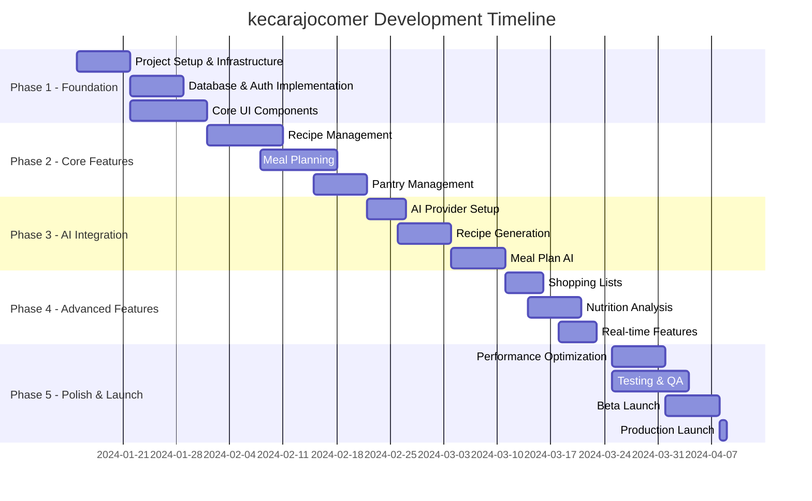

# Implementation Roadmap - kecarajocomer

## Executive Summary

A detailed 12-week implementation plan for building kecarajocomer from scratch, with clear milestones, deliverables, and success metrics. The roadmap emphasizes iterative development, early user feedback, and continuous quality improvement.

## Project Timeline Overview



## Phase 1: Foundation (Weeks 1-2)

### Week 1: Project Setup & Infrastructure

**Objectives**:
- Set up development environment and CI/CD pipeline
- Configure project structure and tooling
- Implement authentication and database foundation

**Tasks**:
```yaml
Day 1-2: Project Initialization
  - Initialize Next.js 15 project with TypeScript
  - Configure ESLint, Prettier, and Husky
  - Set up Git repository and branching strategy
  - Create project documentation structure

Day 3-4: Infrastructure Setup
  - Configure Vercel project and environments
  - Set up Supabase project and database
  - Configure environment variables
  - Implement basic CI/CD with GitHub Actions

Day 5-7: Authentication & Database
  - Implement Supabase Auth integration
  - Create database migrations
  - Set up Row Level Security policies
  - Build auth UI components (login, register, forgot password)
```

**Deliverables**:
- ✅ Working development environment
- ✅ Authentication system
- ✅ Database schema deployed
- ✅ Basic CI/CD pipeline

**Success Metrics**:
- All team members can run project locally
- Users can register and login
- Database migrations run successfully
- CI passes on all commits

### Week 2: Core UI Components & Navigation

**Objectives**:
- Build reusable UI component library
- Implement responsive layouts
- Create navigation and routing structure

**Tasks**:
```yaml
Day 8-10: UI Component Library
  - Implement Button, Input, Card components
  - Create Modal, Dialog, Toast components
  - Build form components with validation
  - Set up Storybook for documentation

Day 11-12: Layout Components
  - Create AppShell with navigation
  - Implement responsive sidebar
  - Build dashboard layout
  - Add loading and error states

Day 13-14: Navigation & Routing
  - Set up protected routes
  - Implement navigation guards
  - Create 404 and error pages
  - Add breadcrumb navigation
```

**Deliverables**:
- ✅ Complete UI component library
- ✅ Responsive layout system
- ✅ Working navigation
- ✅ Storybook documentation

## Phase 2: Core Features (Weeks 3-5)

### Week 3-4: Recipe Management

**Objectives**:
- Implement complete recipe CRUD functionality
- Build recipe search and filtering
- Create recipe detail views

**Tasks**:
```yaml
Week 3: Recipe Backend
  - Create recipe API endpoints
  - Implement recipe search with full-text search
  - Build recipe filtering and sorting
  - Add recipe image upload

Week 4: Recipe Frontend
  - Create recipe list with infinite scroll
  - Build recipe detail page
  - Implement recipe creation/edit forms
  - Add recipe rating and saving features
```

**Deliverables**:
- ✅ Recipe management system
- ✅ Search and filter functionality
- ✅ Recipe creation workflow
- ✅ Image optimization

### Week 5: Meal Planning

**Objectives**:
- Build weekly meal planner interface
- Implement drag-and-drop functionality
- Create meal plan templates

**Tasks**:
```yaml
Day 29-31: Meal Plan Backend
  - Create meal plan data models
  - Build API for meal plan CRUD
  - Implement meal assignment logic

Day 32-35: Meal Plan Frontend
  - Build weekly calendar view
  - Implement drag-and-drop for meals
  - Create meal plan templates
  - Add quick actions and bulk operations
```

**Deliverables**:
- ✅ Weekly meal planner
- ✅ Drag-and-drop interface
- ✅ Meal plan templates
- ✅ Mobile-responsive planner

### Week 6: Pantry Management

**Objectives**:
- Create pantry inventory system
- Implement expiration tracking
- Build pantry insights

**Tasks**:
```yaml
Day 36-38: Pantry Backend
  - Create pantry item models
  - Build inventory tracking API
  - Implement expiration alerts

Day 39-42: Pantry Frontend
  - Create pantry item management UI
  - Build barcode scanner integration
  - Implement quantity tracking
  - Add location management
```

## Phase 3: AI Integration (Weeks 7-9)

### Week 7: AI Provider Setup

**Objectives**:
- Integrate Claude and Gemini APIs
- Build AI abstraction layer
- Implement rate limiting and cost tracking

**Tasks**:
```yaml
Day 43-45: Provider Integration
  - Set up Claude API client
  - Set up Gemini API client
  - Create provider abstraction layer
  - Implement provider selection logic

Day 46-47: Infrastructure
  - Build rate limiting system
  - Create cost tracking
  - Implement caching layer
  - Add error handling and fallbacks
```

### Week 8: Recipe Generation

**Objectives**:
- Implement AI recipe generation
- Build generation UI with streaming
- Create recipe validation

**Tasks**:
```yaml
Day 50-52: Generation Backend
  - Create recipe generation prompts
  - Implement streaming responses
  - Build recipe validation
  - Add nutrition calculation

Day 53-56: Generation Frontend
  - Build recipe generator UI
  - Implement real-time streaming
  - Create preference inputs
  - Add generation history
```

### Week 9: Meal Planning AI

**Objectives**:
- Build AI meal plan generation
- Implement nutrition balancing
- Create shopping optimization

**Tasks**:
```yaml
Day 57-59: Meal Plan AI
  - Create meal planning prompts
  - Implement nutrition balancing
  - Build variety optimization

Day 60-63: Smart Features
  - Add pantry integration
  - Create shopping optimization
  - Implement waste reduction
  - Build meal prep suggestions
```

## Phase 4: Advanced Features (Weeks 10-11)

### Week 10: Shopping & Nutrition

**Objectives**:
- Build smart shopping lists
- Implement nutrition tracking
- Create analytics dashboard

**Tasks**:
```yaml
Day 64-66: Shopping Lists
  - Create shopping list generation
  - Build store organization
  - Implement price tracking
  - Add sharing features

Day 67-70: Nutrition
  - Build nutrition calculator
  - Create daily tracking
  - Implement goal setting
  - Add progress visualization
```

### Week 11: Real-time & Performance

**Objectives**:
- Implement real-time collaboration
- Optimize performance
- Add offline support

**Tasks**:
```yaml
Day 71-73: Real-time Features
  - Implement real-time sync
  - Build collaborative editing
  - Add presence indicators
  - Create notifications

Day 74-77: Performance
  - Implement lazy loading
  - Add service worker
  - Optimize bundle size
  - Implement caching strategies
```

## Phase 5: Polish & Launch (Week 12)

### Week 12: Testing, QA, and Launch

**Objectives**:
- Complete comprehensive testing
- Fix critical bugs
- Prepare for production launch

**Tasks**:
```yaml
Day 78-80: Testing
  - Run E2E test suite
  - Perform load testing
  - Conduct security audit
  - Fix critical bugs

Day 81-82: Beta Launch
  - Deploy to staging
  - Invite beta testers
  - Gather feedback
  - Make final adjustments

Day 83-84: Production Launch
  - Deploy to production
  - Monitor performance
  - Set up alerts
  - Launch marketing
```

## Key Milestones

| Week | Milestone | Success Criteria |
|------|-----------|------------------|
| 2 | Foundation Complete | Auth working, UI components ready |
| 5 | Core Features Done | Recipes, meal planning, pantry functional |
| 9 | AI Integration Complete | Recipe and meal plan generation working |
| 11 | Feature Complete | All features implemented and tested |
| 12 | Production Launch | App live with real users |

## Resource Requirements

### Team Composition
- **Lead Developer**: Full-time (12 weeks)
- **Frontend Developer**: Full-time (10 weeks)
- **Backend Developer**: Full-time (8 weeks)
- **UI/UX Designer**: Part-time (6 weeks)
- **QA Engineer**: Part-time (4 weeks)

### Technology Costs (Monthly)
- **Vercel Pro**: $20/month
- **Supabase Pro**: $25/month
- **Claude API**: ~$200/month (estimated)
- **Gemini API**: ~$100/month (estimated)
- **Monitoring/Analytics**: $50/month
- **Total**: ~$395/month

### Third-Party Services
- **Sentry**: Error tracking
- **PostHog**: Analytics
- **Resend**: Transactional emails
- **Cloudinary**: Image optimization
- **Stripe**: Payment processing (future)

## Risk Mitigation

### Technical Risks

| Risk | Probability | Impact | Mitigation Strategy |
|------|-------------|---------|-------------------|
| AI API Rate Limits | Medium | High | Implement caching, queue system |
| Database Performance | Low | High | Use indexes, connection pooling |
| Bundle Size Too Large | Medium | Medium | Code splitting, lazy loading |
| Real-time Sync Issues | Medium | Medium | Implement conflict resolution |

### Business Risks

| Risk | Probability | Impact | Mitigation Strategy |
|------|-------------|---------|-------------------|
| User Adoption | Medium | High | Beta testing, user feedback loops |
| AI Costs Exceed Budget | Medium | Medium | Usage caps, tier system |
| Competition | High | Medium | Unique features, fast iteration |

## Quality Assurance

### Testing Strategy
```yaml
Unit Tests:
  - Target: 80% code coverage
  - Tools: Jest, React Testing Library
  - Focus: Business logic, utilities

Integration Tests:
  - Target: Critical user paths
  - Tools: Playwright
  - Focus: API endpoints, auth flows

E2E Tests:
  - Target: Core user journeys
  - Tools: Playwright
  - Focus: Complete workflows

Performance Tests:
  - Target: <3s load time
  - Tools: Lighthouse, WebPageTest
  - Focus: Core Web Vitals
```

### Code Quality Standards
- **Linting**: ESLint with strict rules
- **Formatting**: Prettier with pre-commit hooks
- **Type Safety**: Strict TypeScript mode
- **Reviews**: All PRs require review
- **Documentation**: JSDoc for public APIs

## Launch Strategy

### Beta Launch (Week 12, Day 1-3)
- **Target Users**: 50-100 beta testers
- **Focus**: Core feature validation
- **Feedback**: Daily surveys, bug reports
- **Iterations**: Quick fixes and improvements

### Soft Launch (Week 12, Day 4-6)
- **Target Users**: 500-1000 early adopters
- **Marketing**: Limited social media
- **Monitoring**: Performance, errors, usage
- **Support**: Direct email support

### Production Launch (Week 12, Day 7)
- **Target**: Public availability
- **Marketing**: Full campaign launch
- **Support**: Help documentation, FAQ
- **Monitoring**: 24/7 alerts, on-call

## Success Metrics

### Technical Metrics
- **Performance**: LCP < 2.5s, FID < 100ms
- **Availability**: 99.9% uptime
- **Error Rate**: < 0.1% of requests
- **Test Coverage**: > 80%

### Business Metrics
- **User Signups**: 1,000 in first week
- **Active Users**: 60% weekly active
- **AI Usage**: 500 recipes generated daily
- **User Satisfaction**: > 4.5/5 rating

### Growth Metrics
- **Viral Coefficient**: > 1.2
- **Retention**: 40% day-30 retention
- **Engagement**: 5+ sessions per week
- **Revenue**: Break-even in 6 months

## Post-Launch Roadmap

### Month 2
- Social features (sharing, community)
- Mobile app development
- Advanced AI features
- Premium tier launch

### Month 3
- Multi-language support
- Restaurant integration
- Grocery delivery partnerships
- Advanced analytics

### Month 4-6
- Scale to 100k users
- International expansion
- API for developers
- White-label solutions

## Conclusion

This roadmap provides a clear path from concept to production for kecarajocomer. The phased approach allows for iterative development, early user feedback, and risk mitigation. By following this plan, we can deliver a high-quality, scalable meal planning application that leverages AI to provide exceptional user value.