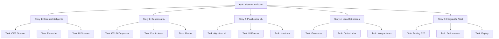

# 📋 Jerarquía de Tareas - Sistema Holístico KeCarajoComér

## 🎯 Epic Principal: Sistema de Comidas Inteligente
**Duración**: 5 semanas | **Estado**: En Progreso

### 📊 Estructura de Tareas



## 📝 Stories y Tasks Detalladas

### Story 1: Scanner de Tickets Inteligente
**Objetivo**: Escanear tickets y agregar items automáticamente a la despensa
**Duración**: 1 semana

#### Tasks:
1. **[SCAN-001] Implementar OCR Scanner**
   - Prioridad: Alta
   - Estimación: 8h
   - Dependencias: Ninguna
   - Criterios de aceptación:
     - [ ] Captura de imagen desde cámara/archivo
     - [ ] OCR con Tesseract.js o Google Vision
     - [ ] Precisión >90% en texto claro
     - [ ] Manejo de múltiples idiomas

2. **[SCAN-002] Parser IA de Tickets**
   - Prioridad: Alta
   - Estimación: 12h
   - Dependencias: SCAN-001
   - Criterios de aceptación:
     - [ ] Extracción de items con GPT-4
     - [ ] Identificación de cantidades y precios
     - [ ] Normalización de nombres
     - [ ] Confidence scoring

3. **[SCAN-003] UI/UX del Scanner**
   - Prioridad: Media
   - Estimación: 6h
   - Dependencias: SCAN-002
   - Criterios de aceptación:
     - [ ] Componente iOS26 glassmorphism
     - [ ] Preview en tiempo real
     - [ ] Edición manual de resultados
     - [ ] Animaciones fluidas

### Story 2: Despensa Inteligente con IA
**Objetivo**: Gestionar inventario con predicciones y alertas inteligentes
**Duración**: 1 semana

#### Tasks:
1. **[PANT-001] CRUD de Despensa**
   - Prioridad: Alta
   - Estimación: 6h
   - Dependencias: Base de datos
   - Criterios de aceptación:
     - [ ] Agregar/editar/eliminar items
     - [ ] Búsqueda y filtros
     - [ ] Categorización automática
     - [ ] Historial de cambios

2. **[PANT-002] Sistema de Predicciones ML**
   - Prioridad: Alta
   - Estimación: 16h
   - Dependencias: PANT-001
   - Criterios de aceptación:
     - [ ] Modelo ARIMA para consumo
     - [ ] Predicción de agotamiento
     - [ ] Sugerencias de reposición
     - [ ] Aprendizaje continuo

3. **[PANT-003] Alertas Inteligentes**
   - Prioridad: Media
   - Estimación: 8h
   - Dependencias: PANT-002
   - Criterios de aceptación:
     - [ ] Notificaciones de caducidad
     - [ ] Alertas de stock bajo
     - [ ] Sugerencias de uso
     - [ ] Configuración personalizable

### Story 3: Planificador de Comidas con ML
**Objetivo**: Generar planes de comida óptimos basados en despensa y preferencias
**Duración**: 1 semana

#### Tasks:
1. **[PLAN-001] Algoritmo de Optimización ML**
   - Prioridad: Alta
   - Estimación: 20h
   - Dependencias: PANT-002
   - Criterios de aceptación:
     - [ ] Optimización multi-objetivo
     - [ ] Balance nutricional
     - [ ] Uso máximo de despensa
     - [ ] Respeto de preferencias

2. **[PLAN-002] UI del Planificador**
   - Prioridad: Alta
   - Estimación: 10h
   - Dependencias: PLAN-001
   - Criterios de aceptación:
     - [ ] Grid semanal drag & drop
     - [ ] Vista de nutrición
     - [ ] Generación con un click
     - [ ] Edición manual

3. **[PLAN-003] Cálculo Nutricional**
   - Prioridad: Media
   - Estimación: 8h
   - Dependencias: PLAN-001
   - Criterios de aceptación:
     - [ ] Base de datos nutricional
     - [ ] Cálculo automático
     - [ ] Visualización de macros
     - [ ] Alertas de desbalance

### Story 4: Lista de Compras Optimizada
**Objetivo**: Generar listas inteligentes minimizando costo y tiempo
**Duración**: 1 semana

#### Tasks:
1. **[SHOP-001] Generador de Listas**
   - Prioridad: Alta
   - Estimación: 8h
   - Dependencias: PLAN-003
   - Criterios de aceptación:
     - [ ] Comparación con despensa
     - [ ] Agrupación por categorías
     - [ ] Cantidades optimizadas
     - [ ] Sugerencias de marcas

2. **[SHOP-002] Optimizador de Precios**
   - Prioridad: Media
   - Estimación: 12h
   - Dependencias: SHOP-001
   - Criterios de aceptación:
     - [ ] Comparación de tiendas
     - [ ] Ruta óptima en tienda
     - [ ] Ofertas y cupones
     - [ ] Presupuesto total

3. **[SHOP-003] Integraciones con Tiendas**
   - Prioridad: Baja
   - Estimación: 16h
   - Dependencias: SHOP-002
   - Criterios de aceptación:
     - [ ] API de supermercados
     - [ ] Compra online
     - [ ] Sincronización de precios
     - [ ] Historial de compras

### Story 5: Integración y Optimización Total
**Objetivo**: Conectar todo el sistema holísticamente
**Duración**: 1 semana

#### Tasks:
1. **[INT-001] Testing E2E del Flujo Completo**
   - Prioridad: Alta
   - Estimación: 12h
   - Dependencias: Todas las stories
   - Criterios de aceptación:
     - [ ] Tests de integración
     - [ ] Tests E2E con Playwright
     - [ ] Cobertura >80%
     - [ ] Performance testing

2. **[INT-002] Optimización de Performance**
   - Prioridad: Alta
   - Estimación: 10h
   - Dependencias: INT-001
   - Criterios de aceptación:
     - [ ] Tiempo de carga <3s
     - [ ] Respuesta API <200ms
     - [ ] Bundle size <500KB
     - [ ] Score Lighthouse >90

3. **[INT-003] Deployment y Monitoreo**
   - Prioridad: Alta
   - Estimación: 8h
   - Dependencias: INT-002
   - Criterios de aceptación:
     - [ ] CI/CD pipeline
     - [ ] Monitoreo con Grafana
     - [ ] Alertas automáticas
     - [ ] Documentación completa

## 🔄 Flujo de Trabajo Autónomo

### Fase 1: Setup (48h)
```bash
# Ejecutar automáticamente
./scripts/autonomous-setup.sh

# Tareas automatizadas:
- ✅ Crear proyecto Next.js
- ✅ Configurar Supabase
- ✅ Instalar dependencias
- ✅ Setup inicial de CI/CD
```

### Fase 2: Desarrollo Iterativo
```typescript
// Ciclo de desarrollo autónomo
const developmentCycle = {
  morning: {
    tasks: ['code_review', 'priority_tasks'],
    duration: '4h'
  },
  afternoon: {
    tasks: ['feature_development', 'testing'],
    duration: '4h'
  },
  evening: {
    tasks: ['documentation', 'planning_next_day'],
    duration: '2h'
  }
};
```

### Fase 3: Validación Continua
```yaml
validation:
  pre_commit:
    - lint
    - type_check
    - unit_tests
  
  pre_merge:
    - integration_tests
    - e2e_tests
    - performance_tests
  
  post_deploy:
    - smoke_tests
    - monitoring_alerts
    - user_feedback
```

## 📈 Métricas de Progreso

### KPIs del Proyecto
- **Velocidad**: 40 story points/semana
- **Calidad**: <2 bugs/feature
- **Cobertura**: >85% código
- **Performance**: <100ms response time

### Dashboard de Progreso
```typescript
interface ProjectMetrics {
  completed: {
    stories: 0,
    tasks: 0,
    tests: 0
  },
  inProgress: {
    stories: 5,
    tasks: 15,
    blockers: 0
  },
  pending: {
    stories: 0,
    tasks: 0,
    estimated: '3 weeks'
  },
  quality: {
    coverage: 0,
    bugs: 0,
    techDebt: 'low'
  }
}
```

## 🚀 Comandos de Ejecución Autónoma

```bash
# Iniciar desarrollo autónomo
npm run dev:autonomous

# Ejecutar suite completa de tests
npm run test:all

# Deploy automático con validación
npm run deploy:smart

# Monitoreo en tiempo real
npm run monitor:live
```

## 📊 Entregables por Semana

### Semana 1: Foundation
- ✅ Base de datos configurada
- ✅ Autenticación funcionando
- ✅ Scanner básico implementado

### Semana 2: Core Features
- ✅ Despensa completa
- ✅ Parser de tickets con IA
- ✅ UI/UX pulido

### Semana 3: Intelligence
- ✅ Planificador con ML
- ✅ Predicciones funcionando
- ✅ Optimización de listas

### Semana 4: Integration
- ✅ Sistema holístico conectado
- ✅ Testing completo
- ✅ Performance optimizado

### Semana 5: Polish & Deploy
- ✅ Bug fixes
- ✅ Documentación
- ✅ Deploy a producción
- ✅ Monitoreo activo

---

Este plan jerárquico permite la implementación autónoma del sistema completo, con tareas claras, dependencias definidas y criterios de éxito medibles.