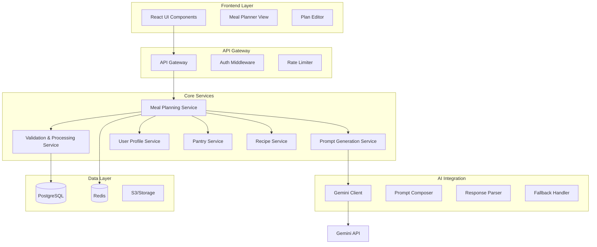

# AI-Powered Weekly Meal Planner Architecture Design

## Executive Summary

This document outlines the architecture and design for an AI-powered weekly meal planning feature using Google Gemini. The system enables users to generate personalized meal plans based on their dietary preferences, pantry inventory, and nutritional goals.

## System Architecture Overview



## Core Components

### 1. Meal Planning Service (MPS)
The orchestrator service that coordinates the meal planning process.

**Responsibilities:**
- Coordinate between different services
- Manage planning sessions
- Handle user preferences and constraints
- Orchestrate AI generation process

### 2. Prompt Generation Service (PGS)
Specialized service for creating optimized Gemini prompts.

**Key Features:**
- Dynamic prompt templating
- Context injection (user profile, pantry, preferences)
- Token optimization strategies
- Batch processing for large plans

### 3. Gemini Integration Layer

**Components:**
- **Prompt Composer**: Builds structured prompts
- **Response Parser**: Validates and parses JSON responses
- **Fallback Handler**: Manages failures and retries
- **Token Manager**: Tracks and optimizes token usage

## Data Models

### User Profile Schema
```typescript
interface UserProfile {
  id: string;
  dietaryPreferences: {
    type: DietType; // vegano, keto, omnívoro, etc.
    allergies: string[];
    medicalRestrictions: string[];
    culturalPreferences: string[];
  };
  nutritionalGoals: {
    objective: NutritionalObjective; // bajar peso, ganar masa, mantenimiento
    dailyCalories: number;
    macroTargets?: MacroNutrients;
  };
  cookingPreferences: {
    experienceLevel: ExperienceLevel;
    maxPrepTime: number;
    preferredCuisines: string[];
    kitchenEquipment: string[];
  };
  planningPreferences: {
    weekdaySimplicity: boolean;
    weekendElaboration: boolean;
    varietyLevel: VarietyLevel;
    budgetRange: BudgetRange;
  };
}
```

### Meal Plan Schema
```typescript
interface MealPlan {
  id: string;
  userId: string;
  dateRange: {
    start: Date;
    end: Date;
  };
  status: PlanStatus;
  slots: MealSlot[];
  metadata: {
    createdAt: Date;
    updatedAt: Date;
    generationMethod: 'ai' | 'manual' | 'hybrid';
    tokenUsage?: number;
  };
}

interface MealSlot {
  id: string;
  day: DayOfWeek;
  slotType: SlotType; // desayuno, almuerzo, merienda, cena
  schedule: {
    time: string;
    servings: number;
  };
  recipe?: Recipe;
  locked: boolean;
  needsManualAction: boolean;
  customizations?: {
    excludedIngredients?: string[];
    notes?: string;
  };
}

interface Recipe {
  id: string;
  name: string;
  ingredients: Ingredient[];
  steps: string[];
  prepTime: number;
  cookTime: number;
  nutritionalInfo: {
    calories: number;
    macros: MacroNutrients;
    tags: string[];
  };
  metadata: {
    usesPantry: boolean;
    isFavorite: boolean;
    difficulty: DifficultyLevel;
    cuisine: string;
  };
}
```

### Pantry Schema
```typescript
interface PantryItem {
  id: string;
  userId: string;
  ingredient: {
    id: string;
    name: string;
    category: string;
  };
  quantity: number;
  unit: string;
  expirationDate?: Date;
  stockLevel: StockLevel; // low, medium, high
  location?: string; // refrigerator, pantry, freezer
}
```

## Gemini Prompt Engineering Strategy

### 1. Modular Prompt Architecture

```typescript
interface PromptTemplate {
  basePrompt: string;
  contextSections: {
    userProfile: string;
    pantryInventory: string;
    preferences: string;
    constraints: string;
    lockedSlots: string;
  };
  outputFormat: string;
  rules: string[];
}
```

### 2. Token-Efficient Prompt Template

```javascript
const MEAL_PLAN_PROMPT_TEMPLATE = `
Generate a meal plan in JSON format for the following requirements:

USER CONTEXT:
- Diet: {dietType}
- Allergies: {allergies}
- Calorie target: {calories}/day
- Cooking level: {experienceLevel}
- Restrictions: {restrictions}

PLANNING PARAMETERS:
- Days: {planDays}
- Slots per day: {slotsPerDay}
- Time constraints: Weekdays (simple, <30min), Weekends (flexible)
- Variety: {varietyLevel}

PANTRY ITEMS (use when possible):
{pantryItems}

LOCKED MEALS (do not change):
{lockedSlots}

RULES:
1. Return ONLY valid JSON, no additional text
2. Respect all dietary restrictions and allergies
3. Vary ingredients throughout the week
4. Prioritize pantry items to reduce waste
5. Include estimated calories and prep time
6. Mark slots needing manual action if constraints cannot be met

OUTPUT FORMAT:
{jsonSchema}
`;
```

### 3. Batch Processing Strategy

```typescript
class GeminiPromptStrategy {
  async generateWeeklyPlan(params: PlanParams): Promise<MealPlan> {
    const tokenEstimate = this.estimateTokens(params);
    
    if (tokenEstimate < GEMINI_TOKEN_LIMIT) {
      // Single request for entire week
      return this.generateFullWeek(params);
    } else {
      // Split into batches
      const batches = this.createBatches(params);
      const results = await Promise.all(
        batches.map(batch => this.generateBatch(batch))
      );
      return this.mergeBatches(results);
    }
  }
  
  private createBatches(params: PlanParams): BatchParams[] {
    // Smart batching logic:
    // - Group by day ranges (Mon-Wed, Thu-Fri, Weekend)
    // - Or by meal types (all breakfasts, all lunches, etc.)
    // - Based on token optimization
  }
}
```

### 4. Fallback and Error Handling

```typescript
class GeminiFallbackHandler {
  async handleGenerationFailure(
    error: Error, 
    params: PlanParams
  ): Promise<MealPlan> {
    if (error.type === 'TOKEN_LIMIT') {
      // Reduce context and retry
      return this.retryWithReducedContext(params);
    } else if (error.type === 'INVALID_JSON') {
      // Retry with stricter formatting instructions
      return this.retryWithStrictFormat(params);
    } else if (error.type === 'TIMEOUT') {
      // Generate partial plan
      return this.generatePartialPlan(params);
    }
    
    // Ultimate fallback: template-based generation
    return this.generateFromTemplates(params);
  }
}
```

## API Design

### REST Endpoints

```yaml
# Generate new meal plan
POST /api/meal-plans/generate
Request:
  {
    "dateRange": {
      "start": "2024-01-15",
      "end": "2024-01-21"
    },
    "preferences": {
      "excludeIngredients": ["gluten", "lactose"],
      "maxPrepTime": 30,
      "cuisineTypes": ["italian", "mexican"]
    },
    "lockedSlots": [
      {
        "day": "Monday",
        "slot": "lunch",
        "recipeId": "rec_123"
      }
    ]
  }
Response:
  {
    "planId": "plan_abc123",
    "status": "generated",
    "plan": { ... }
  }

# Update specific slot
PATCH /api/meal-plans/{planId}/slots/{slotId}

# Get plan with recipes
GET /api/meal-plans/{planId}?include=recipes,nutrition

# Lock/unlock slots
POST /api/meal-plans/{planId}/slots/{slotId}/lock

# Regenerate specific slots
POST /api/meal-plans/{planId}/regenerate
Request:
  {
    "slotIds": ["slot_1", "slot_2"],
    "keepConstraints": true
  }
```

### GraphQL Alternative

```graphql
type Query {
  mealPlan(id: ID!): MealPlan
  currentWeekPlan(userId: ID!): MealPlan
}

type Mutation {
  generateMealPlan(input: GeneratePlanInput!): MealPlan!
  updateMealSlot(planId: ID!, slotId: ID!, recipe: RecipeInput!): MealSlot!
  lockSlot(planId: ID!, slotId: ID!): MealSlot!
  regenerateSlots(planId: ID!, slotIds: [ID!]!): MealPlan!
}

type MealPlan {
  id: ID!
  dateRange: DateRange!
  slots: [MealSlot!]!
  nutritionalSummary: NutritionalSummary!
  shoppingList: ShoppingList!
}
```

## Performance Optimizations

### 1. Caching Strategy

```typescript
class MealPlanCache {
  // Cache generated plans for quick modifications
  async cachePlan(plan: MealPlan): Promise<void> {
    await redis.setex(
      `plan:${plan.id}`,
      3600 * 24 * 7, // 1 week
      JSON.stringify(plan)
    );
  }
  
  // Cache Gemini responses for similar requests
  async cacheGeminiResponse(
    promptHash: string, 
    response: any
  ): Promise<void> {
    await redis.setex(
      `gemini:${promptHash}`,
      3600 * 24, // 24 hours
      JSON.stringify(response)
    );
  }
  
  // Cache user preferences for quick access
  async cacheUserContext(userId: string, context: any): Promise<void> {
    await redis.setex(
      `user:context:${userId}`,
      3600 * 24 * 30, // 30 days
      JSON.stringify(context)
    );
  }
}
```

### 2. Request Optimization

```typescript
class RequestOptimizer {
  // Debounce multiple slot updates
  private updateQueue: Map<string, SlotUpdate[]> = new Map();
  
  async queueSlotUpdate(planId: string, update: SlotUpdate): Promise<void> {
    if (!this.updateQueue.has(planId)) {
      this.updateQueue.set(planId, []);
      // Process after 500ms of inactivity
      setTimeout(() => this.processBatch(planId), 500);
    }
    this.updateQueue.get(planId)!.push(update);
  }
  
  // Prefetch likely next requests
  async prefetchSuggestions(userId: string): Promise<void> {
    const patterns = await this.analyzeUserPatterns(userId);
    const likelyRequests = this.predictNextRequests(patterns);
    
    // Warm up cache with likely scenarios
    for (const request of likelyRequests) {
      this.warmCache(request);
    }
  }
}
```

## Security Considerations

### 1. Input Validation

```typescript
class MealPlanValidator {
  validateGenerateRequest(req: GeneratePlanRequest): ValidationResult {
    const rules = [
      this.validateDateRange(req.dateRange),
      this.validatePreferences(req.preferences),
      this.validateLockedSlots(req.lockedSlots),
      this.sanitizeExcludedIngredients(req.excludeIngredients)
    ];
    
    return this.aggregateResults(rules);
  }
  
  // Prevent prompt injection
  sanitizeUserInput(input: string): string {
    return input
      .replace(/[<>]/g, '') // Remove potential HTML
      .replace(/\{|\}/g, '') // Remove JSON delimiters
      .trim()
      .substring(0, MAX_INPUT_LENGTH);
  }
}
```

### 2. Rate Limiting

```typescript
const rateLimitConfig = {
  generatePlan: {
    window: '1h',
    max: 10 // 10 generations per hour per user
  },
  updateSlot: {
    window: '1m',
    max: 30 // 30 updates per minute
  },
  geminiRequests: {
    window: '1m',
    max: 20 // Global Gemini API limit
  }
};
```

## Frontend Integration

### React Component Architecture

```typescript
// Main planner component
interface MealPlannerProps {
  userId: string;
  initialPlan?: MealPlan;
}

const MealPlanner: React.FC<MealPlannerProps> = ({ userId, initialPlan }) => {
  const [plan, setPlan] = useState<MealPlan | null>(initialPlan);
  const [loading, setLoading] = useState(false);
  const [selectedSlots, setSelectedSlots] = useState<Set<string>>(new Set());
  
  // Hooks for data fetching
  const { userProfile } = useUserProfile(userId);
  const { pantryItems } = usePantry(userId);
  const { generatePlan, updateSlot, lockSlot } = useMealPlanAPI();
  
  return (
    <MealPlannerLayout>
      <PlannerHeader 
        onGenerate={handleGenerate}
        dateRange={plan?.dateRange}
      />
      <WeekView 
        plan={plan}
        onSlotClick={handleSlotClick}
        onSlotLock={handleSlotLock}
        selectedSlots={selectedSlots}
      />
      <PlannerSidebar
        nutritionalSummary={plan?.nutritionalSummary}
        shoppingList={plan?.shoppingList}
      />
    </MealPlannerLayout>
  );
};
```

### State Management

```typescript
// Zustand store for meal planning
interface MealPlanStore {
  currentPlan: MealPlan | null;
  isGenerating: boolean;
  modifiedSlots: Set<string>;
  
  // Actions
  generatePlan: (params: GeneratePlanParams) => Promise<void>;
  updateSlot: (slotId: string, recipe: Recipe) => Promise<void>;
  lockSlot: (slotId: string) => void;
  regenerateSlots: (slotIds: string[]) => Promise<void>;
  
  // Optimistic updates
  optimisticUpdateSlot: (slotId: string, recipe: Recipe) => void;
  revertOptimisticUpdate: (slotId: string) => void;
}
```

## Monitoring and Analytics

### Key Metrics

```yaml
Business Metrics:
  - Plans generated per day/week
  - Average slots modified per plan
  - User retention after first plan
  - Most locked recipes
  - Ingredient usage patterns

Technical Metrics:
  - Gemini API response time
  - Token usage per request
  - Cache hit rate
  - Generation success rate
  - Fallback activation frequency

User Experience Metrics:
  - Time to generate plan
  - Number of regenerations needed
  - Slot modification frequency
  - Feature adoption rate
```

### Logging Strategy

```typescript
interface MealPlannerLogger {
  logPlanGeneration(event: {
    userId: string;
    planId: string;
    duration: number;
    tokenUsage: number;
    method: 'full' | 'batch' | 'fallback';
    success: boolean;
    error?: string;
  }): void;
  
  logSlotModification(event: {
    userId: string;
    planId: string;
    slotId: string;
    modificationType: 'update' | 'lock' | 'unlock';
    source: 'user' | 'ai_suggestion';
  }): void;
  
  logGeminiInteraction(event: {
    promptTokens: number;
    responseTokens: number;
    latency: number;
    success: boolean;
    retries: number;
  }): void;
}
```

## Implementation Phases

### Phase 1: MVP (Week 1-2)
- Basic user profile and preferences
- Simple Gemini integration
- Generate weekly plans (all slots)
- Basic slot editing
- JSON response parsing

### Phase 2: Enhanced Features (Week 3-4)
- Pantry integration
- Recipe locking
- Nutritional calculations
- Batch processing for large plans
- Improved error handling

### Phase 3: Optimization (Week 5-6)
- Caching layer
- Performance optimizations
- Advanced prompt engineering
- Shopping list generation
- Mobile responsive UI

### Phase 4: Advanced Features (Week 7-8)
- Historical meal tracking
- Preference learning
- Recipe suggestions
- Meal prep workflows
- Export/sharing features

## Testing Strategy

### Unit Tests
```typescript
describe('GeminiPromptGenerator', () => {
  it('should generate valid prompts within token limits', () => {
    const generator = new GeminiPromptGenerator();
    const prompt = generator.generate(mockUserProfile, mockPreferences);
    
    expect(countTokens(prompt)).toBeLessThan(MAX_TOKENS);
    expect(prompt).toContain('USER CONTEXT');
    expect(prompt).toContain('OUTPUT FORMAT');
  });
  
  it('should handle locked slots correctly', () => {
    const lockedSlots = [/* ... */];
    const prompt = generator.generate(mockProfile, { lockedSlots });
    
    expect(prompt).toContain('LOCKED MEALS');
    expect(prompt).toContain(lockedSlots[0].recipeId);
  });
});
```

### Integration Tests
```typescript
describe('MealPlannerAPI', () => {
  it('should generate complete weekly plan', async () => {
    const response = await request(app)
      .post('/api/meal-plans/generate')
      .send(validGenerateRequest)
      .expect(200);
    
    expect(response.body.plan).toBeDefined();
    expect(response.body.plan.slots).toHaveLength(28); // 7 days * 4 slots
  });
});
```

## Conclusion

This architecture provides a robust, scalable solution for AI-powered meal planning with Gemini integration. The modular design allows for incremental feature development while maintaining performance and reliability. The token-efficient prompt engineering and intelligent batching strategies ensure optimal use of the Gemini API while providing users with personalized, contextually-aware meal plans.